<!--
	Author:LEO
	WeChat:zw142857
	QQ:765508285
-->
# 面向对象基础复习

## JavaScript-多范式编程语言

> js是一个基于对象的多范式编程语言

### 多范式编程

- 面向过程
- 面向对象
- 函数式(链式编程):以点语法为基本规则

## 面向对象基本概念

### 面向过程

- 一步一步 前因后果

### 面向对象

- 只求结果 不管实现过程,实际上就是对面向过程中的每一步进行封装

### 面向对象三大特征

- **封装**:将面向过程每一步进行推进:对同种对象的属性和方法进行抽象，成为一个**类**(js中没有类的概念，实际上也是一个对象)，然后通过**类**的方法和属性来访问**类**
- **继承**:在封装的基础上，将同类事物继续抽象，继承时，子类拥有父类的属性和方法，同时拥有自己特有的属性和方法
- **多态**:不同对象对同一事物做出不同的回应，通常出现在继承后对方法的重写

> 封装 继承 多态 都是对具体事务的**抽象** 

> **抽象**是实现面向对象编程的基本思想

> **抽象**抽取事务主要特征对事务进行描述

## 什么是对象

> 万物皆对象

### 数据集

- 很多数据放到一起:例如数组中的数据，对象中的数据 都是将零散的数据放到一个数据集中,这个数据集就是指数组这个对象以及Object这个对象
 
### 功能集

- 函数集&方法集:重复的代码封装到函数中，将所有的函数放到一个对象中成为对象的方法，此对象就可以看做是一个函数集

## 数据类型

### 基本数据类型(值类型)

	// 基本数据类型
	string number boolean
	
	// 检测基本数据类型
	var str = “123”;
	console.log(typeof str);// string

### 复杂数据类型（引用数据类型）

	// Object(数组，时间，函数，正则...)
	
	// 检测复杂数据类型
	1.使用typeof不能检测到真实类型(函数例外)
	
	var arr = [ 1, 2, 3 ];
	var fn = function () {};
	var o = { name: 'itcast' };

	console.log( typeof arr ); // object
	console.log( typeof fn ); // function
	console.log( typeof o ); // object
	console.log( typeof new Date() ); // object
	
	2.使用Object.prototype.tostring.apply()
	
	console.log(  Object.prototype.toString.apply( arr ) );//[object Array]
	console.log(  Object.prototype.toString.apply( fn ) ); //[object Function]
	console.log(  Object.prototype.toString.apply( o ) ); // [object Object]
	console.log(  Object.prototype.toString.apply( new Date() ) );// [object Date]

	console.log(  Object.prototype.toString.apply( null ) );// [object Null]
	console.log(  Object.prototype.toString.apply( undefined ) ); // [object Undefined]

### 空类型

	null undefined

## 引用类型的拷贝

	var p = {
		name: '张三',
		age: 19,
		gender: '男',
		clone: function () {
			// 目的是为了完成对自己的拷贝
			var temp = {};
			temp.name = this.name;
			temp.age = this.age;
			temp.gender = this.gender;
			temp.clone = this.clone;
			return temp;
		}
	};

	var p1 = p.clone();

	p.name = '李四';

	var p2 = p1.clone();
	p1.name = '王五';

### 浅拷贝

- 拷贝引用:如果对象的属性也是一个引用类型,拷贝的时候不重新创建一个新的对象来实现该属性的拷贝,那么就是浅拷贝
- 对象的直接赋值就是浅拷贝

### 深拷贝

- 拷贝数据:将两个对象完全从内存中隔离开,就是深拷贝。即每一个引用属性,以及引用属性的引用属性,全部拷贝出来.
- 遍历对象的每一项数据,实现复制就是深拷贝

## 构造函数(构造器)

### 对象的动态特性

- js中的对象如果没有设置指定的属性,只需要利用赋值就可以给该对象提供该属性

		var o = {}; // 没有添加任何属性的对象
		o.name = "zxx"; // 赋值时动态添加了name属性
		
### 点语法&关联数组语法

- 点语法

		var o = {};
		o.name = 'zxx';// 点语法赋值
		console.log(o.name);// 点语法取值
		
- 关联数组语法

		var o = {};
		o['name'] = 'zxx'; // 关联数组语法赋值
		console.log(o['name']);// 关联数组语法取值
		
> name这个变量尽量少用,系统中存在一个变量叫name,有可能会冲突
		

### 工厂函数模式

	function Person(name,age,gender){
		var p = {};
		p.name = name;
		p.age = age;
		p.gender = gender;
		return p; 
	}

	var p1 = Person('zs',18,'男');
	var p2 = Person('ls',16,'女');

### 构造函数模式

	// 构造器定义:1.不需要再函数内部显示创建对象 2.属性和方法绑定到this上 3.不需要return
	function Person(name,age,gender){
		this.name = name;
		this.age = age;
		this.gender = gender;
	}
	
	// 构造器创建对象 使用 new 创建对象
	var p = new Person(‘zs’,18,'男');

## 异常与捕获

### 常见异常

	Uncaught ReferenceError 未捕获的引用错误
	Uncaught TypeError 未捕获的类型错误
	Uncaught SyntaxError 未捕获的语法错误

### 异常捕获语法
	
	try{
		// 正常执行的代码
	}catch(e){
		// 出现异常执行
	}
	
	********
	try{
		// 正常执行的代码
	}catch(e){
		// 出现异常执行
	}finally{
		// 无论是否出现异常 try-catch执行完毕 都会执行这里面的代码
		// 一般用于释放资源
	}

### 自定义抛出异常

- 语法: `throw new Error( 错误的消息 )`

		console.log( '123' );
		try {
			var e1 = new Error( '用户自己定义的异常对象' );
			throw e1;
		} catch ( e ) {
			console.log( e1 === e );
		}
		console.log( '456' );

## DOM操作复习

### 获取元素
#### 获取指定元素

**`document.getElementById`: 通过id寻找一个元素（找到的是一个元素对象） 该方法只能被document对象调用（同一个文档中id不能重复）**

	

	var box = document.getElementById(“box”);

**`document.getElementsByTagName`: 通过标签名寻找一类元素（找到的是由元素对象组成的伪数组,既可以被document调用，又可以被元素对象调用，被元素对象调时表示在该元素对象内部执行查找**

	

        

        

    

    

    

    var divs = document.getElementsByTagName("div");// 获取页面上所有的div,divs是一个伪数组
    var cl = document.getElementById("cl");// 获取id为cl的元素
    var cl2s = cl.getElementsByTagName("div");// 获取cl元素下面所有的div标签,cl2s是一个伪数组
    
    
**`document.getElementsByClassName`: 通过类名寻找包含这个类名的元素**

	 

        

        

    

    

    var cls = document.getElementsByClassName("cl");//获取到的是一个伪数组,里面装的是div p span a这四个元素对象(只要标签中的class中有传入的类名就能获取到)
    
#### 获取子元素&兄弟元素&父元素

**`element.childNodes`: 获取指定元素的子节点,包括文本节点、元素节点等**
**`element.children`: 获取指定元素的子元素,只会获取元素节点**
**`element.nextSibling`: 获取指定元素的下一个兄弟节点**
**`element.nextElementSibling`: 获取指定元素的下一个兄弟元素**
**`element.previousSibling`: 获取指定元素的上一个兄弟节点**
**`element.previousElementSibling`: 获取指定元素的上一个兄弟元素**
**`element.parentNode`: 获取元素的父节点,父节点肯定是一个元素**

	<ul id="list">
        <li id="firstlink"><a href="javascript:void(0)">首页</a></li>
        <li><a href="javascript:void(0)">播客</a></li>
        <li><a href="javascript:void(0)">博客</a></li>
        <li><a href="javascript:void(0)">相册</a></li>
        <li><a href="javascript:void(0)">关于</a></li>
        <li id="lastlink"><a href="javascript:void(0)">帮助</a></li>

	</ul>

	// 通过id获取元素对象
	var ul = document.getElementById("list");
	// 通过标签名获取元素数组
	var lis = ul.getElementsByTagName("li");
	// 不关心层级 只找指定标签
	// 缺点:如果内部还有li 也会找到
	
	var nodes = ul.childNodes;
	//子节点 只找子级
	//缺点:除了我们想要的元素节点 还会获取到其他节点
	
	var children = ul.children;//只获取ul下的子元素
	
	var link = document.getElementById("firstlink");
	var nextNodeSibling = link.nextSibling; // 获取到的是换行(文本节点)
	var nextElementSibling = link.nextElementSibling;//获取到的是下一个li标签
	
	var parentNode = link.parentNode;// 获取到的是ul

#### 获取第一&最后一个子元素

**`element.firstChild`: 获取指定元素下面的第一个子节点**
**`element.firstElementChild`: 获取指定元素下面的第一个子元素**
**`element.lastChild`: 获取指定元素下面的最后一个子节点**
**`element.lastElementChild`: 获取指定元素下面的最后一个子元素**

	var firstNode = ul.firstChild;// 获取到的是换行(文本节点)
	var firstElement = ul.firstElementChild;// 获取到的是firstlink
	var lastNode = ul.lastChild;// 获取到的是换行(文本节点)
	var lastElement = ul.lastElementChild;// 获取到的是lastlink

### 节点操作

#### 克隆节点 - cloneNode()

- **`element.cloneNode()`: 复制element节点**
- **参数:布尔值**
	- **true代表深层克隆,把当前节点和内部所有节点都复制一份**
	- **false代表浅层克隆,只复制当前节点**

			

	    	

			

			var father = document.getElementById("father");
			var son = document.getElementById("son");
			var clone = son.cloneNode(true);// 把son这个div复制一份 复制出来的clone和son没有任何关系了
	
#### 添加节点 - appendChild()

**`father.appendChild(son)`:将son节点追加到father内部的最后位置**

	

   	

	

	

	var father = document.getElementById("father");
	var demo = document.getElementById("demo");
	var clone = demo.cloneNode(true);// 将demo克隆一份 
	father.appendChild(clone);// 将克隆出来的clone追加到father中

	// 此时页面结构应该为
	

	    

	    

	

	

	
	/*追加克隆节点对原节点不会产生影响*/
	
	//如果代码如下 则会将demo节点直接移动到father节点下
	father.appendChild(demo);// demo是页面上存在的节点
	
	// 此时页面结构应该为
	

	    

	    

	

#### 插入节点 - insertBefore()

**`father.inserBefore(son1,son2)`: 将son1插入到father节点下的son2前面**

	

   	

	

	

	var father = document.getElementById("father");
	var son = document.getElementById("son");
	var demo = document.getElementById("demo");
	
	father.inserBefore(son,demo);//会直接将demo节点移动到father下的son前面       
	
	/*插入克隆出来的节点也不会对原节点产生影响*/
	
#### 移除节点 - removeChild()

**`father.removeChild(son)`: 将father下的son节点移除**

	

  		

	

	var father = document.getElementById("father");
	var son = document.getElementById("son");
	
	father.removeChild(son);// 直接将son节点删除

### 创建结构

#### document.write()

**`document.write("内容")` 特点:只能被document调用,而且会覆盖页面上原有内容**

	document.write("<a href="http://www.baidu.com">百度</a>")
	// 可以在页面上创建一个a标签,而且会覆盖页面上原有的所有内容
	
#### element.innerHtml

**`element.innerHtml`特点:往页面添加html标签,可以限定范围**

	

    var box = document.getElementById("box");
    box.innerHtml = "<a href="http://www.baidu.com">百度</a>";

    // 追加后的结构为
    

        <a href="http://www.baidu.com">百度</a>
    

    
#### document.createElement()

**`document.createElement("内容")`特点:动态创建标签,添加到页面需要配合appendChild使用**

	

	var box = document.getElementById("box");
	var input = document.createElement("input");
	input.type = "text";
	box.appendChild(input);
	
### 标签的自定义属性操作

#### setAttribute()

**设置标签属性: `setAttribute()`**

	

	var box = document.getElementById("box");
	box.setAttribute("id","aaa");// 有规定的属性可以设置
	box.setAttribute("bbb","ccc");// 没有规定的属性也可以设置
	
#### getAttribute()

**获取标签属性:`getAttribute()`**

	

	var box = document.getElementById("box");
	box.getAttribute("id");// 有规定的可以获取
	box.getAttribute("aaa"); // 没有规定的也可以获取
	
#### removeAttribute()

**移除标签属性:`removeAttribute()`**

	

	var box = document.getElementById("box");
	box.removeAttribute("id"); // 有规定的可以删除
	box.removeAttribute("aaa"); // 没有规定的也可以删除

### 兼容方法

#### innerText兼容写法

**获取文本**

	function getInnerText(element) {
	    // 能力检测 判断是否有这一属性
	    if (typeof element.innerText === "string") {
	        return element.innerText;
	    } else {
	        return element.textContent;
	    }
	}
	
**设置文本**

	function setInnerText(element, content) {
	    // 能力检测 判断是否有这一属性
	    if (typeof element.innerText === "string") {
	        element.innerText = content;
	    } else {
	        element.textContent = content;
	    }
	}
	
#### 获取上一个&下一个兄弟元素的兼容写法

**获取下一个兄弟元素兼容写法**

	// 获取下一个兄弟元素
	function getNextElement(element){
	    if(element.nextElementSibling){
	        //能找到nextElementSibling这个属性 就可以直接使用
	        return element.nextElementSibling;
	    }else{
	        var next = element.nextSibling;// 获取下一个兄弟节点
	        // 如果next就是想要的下一个兄弟元素 就直接返回 如果不是 就一直找
	        while(next&&next.nodeType !==1){//next找到了而且不是想要的元素节点就继续找
	            next = next.nextSibling;
	        }
	        return next;
	    }
	}
	
**获取上一个兄弟元素兼容写法**

	// 获取上一个兄弟元素
	function getPreviousElement(element){
	    if(element.previousElementSibling){
	        return element.previousElementSibling;
	    }else{
	        var previous = element.previousSibling;
	        while(previous&&previous.nodeType !== 1){
	            previous = element.previousSibling;
	        }
	        return previous;
	    }
	}
	
#### 获取第一个子元素&最后一个子元素的兼容写法

**获取第一个子元素兼容写法**

	// 获取element的第一个子元素
	function getFirstElement(element){
	    // 判断是否支持这一写法
	    if(element.firstElementChild){
	        return element.firstElementChild;
	    }else{
	        // 先找到第一个节点
	        var first = element.firstChild;
	        // 如果这个节点存在而且这个节点不是元素节点
	        while(first&&first.nodeType !== 1){
	            // 从这个节点向后继续找下一个兄弟节点
	            first = first.nextSibling;
	        }
	        return first;
	    }
	}

**获取最后一个子元素兼容写法**

	// 获取element的最后一个子元素
	function getLastElement(element){
	    // 判断是否支持这一写法
	    if(element.lastElementChild){
	        return element.lastElementChild;
	    }else{
	        // 先找到最后一个个节点
	        var last = element.lastChild;
	        // 如果这个节点存在而且这个节点不是元素节点
	        while(last&&last.nodeType !== 1){
	            // 从这个节点向前继续找上一个兄弟节点
	            last = last.previousSibling;
	        }
	        return last;
	    }
	}
	
#### 通过类名获取元素对象的兼容方法

	function getElementsByClassName(element, className) {
        var filterArr = [];
        var elements = element.getElementsByTagName("*");
        for (var i = 0; i < elements.length; i++) {
            var nameArr = elements[i].className.split(" ");
            for (var j = 0; j < nameArr.length; j++) {
                if (nameArr[j] === className) {
                    filterArr.push(elements[i]);
                    break;
                }
            }
        }
        return filterArr;
    }
    
### 事件

	var box = document.getElementById("box");
	
	box.onclick = function(){
	    // 鼠标单击事件
	}
	
	box.dblclick = function(){
	    // 鼠标双击事件
	}
	
	box.onmouseover = function(){
	    // 鼠标移入事件
	}
	
	box.onmouseout = function(){
	    // 鼠标移出事件
	}
	
	
	box.onfocus = function(){
	    // 聚焦事件
	}
	
	box.onblur = function(){
	    // 失去焦点事件
	}
	
	box.onkeyup = function(){
	    // 按键弹起事件
	}
	
	box.onkeydown = function(){
	    // 按键按下事件
	}

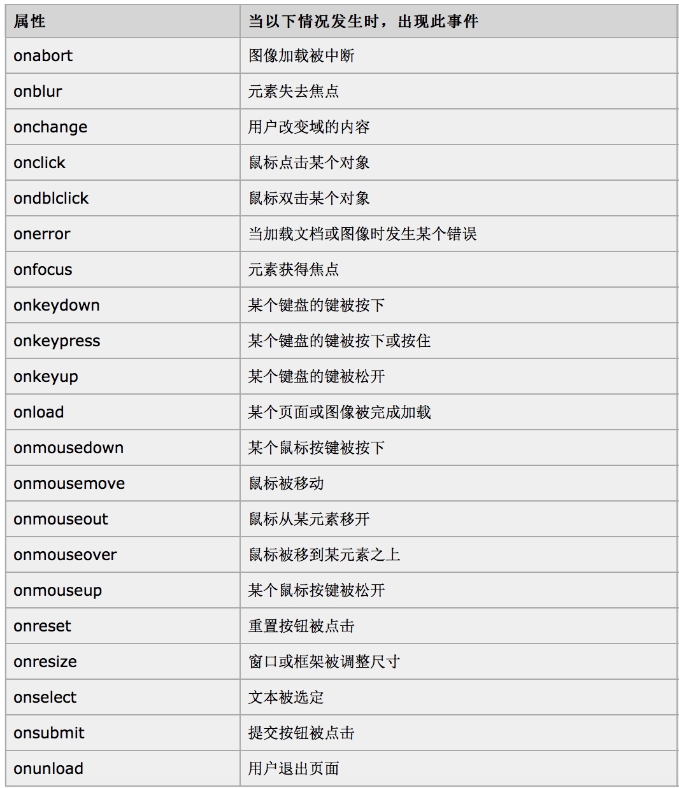

# 原型与继承

## 为什么需要原型?

> 每执行一次函数, 函数内部的所有内容, 都会被重新创建一次,所以构造器创建对象的时候, 实际上会有成员重复.
> 如果使用 构造器 this.方法名 = function .... 方式创建对象. 那么每一个对象
	对应的方法就会重复. 
> **可以借助函数的原型来解决对象方法重复创建这一问题**

### 对象共有属性重复创建问题

	function Person ( name ) {
		this.name = name;
		// 可以说话, 需要有一个方法
		this.sayHello = function () {
			console.log( '你好, 我是 ' + this.name );
		};
	}

	var p1 = new Person( '李雷' );
	var p2 = new Person( '韩梅梅' );

	p1.sayHello();
	p2.sayHello();
	
	// 由于函数 Person 创建对象的时候 会 同时生成 里面的 sayHello 方法
	// 因此使得每一个 Person 的对象, 都包含一个内容完全相同, 不同的 sayHello 方法
	
	// 验证
	console.log( p1.sayHello == p2.sayHello );

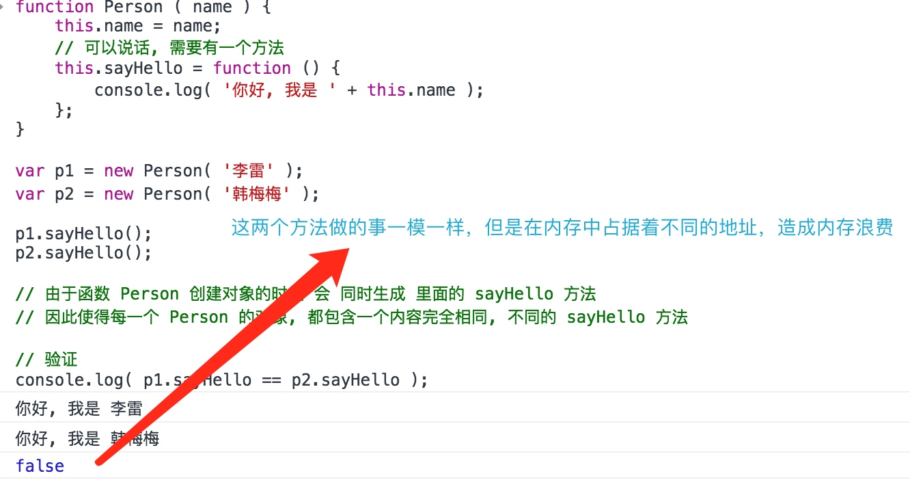

## 原型概念

> 每一个函数都有一个属性 `prototype` 该属性指向一个对象.
**每一个由该函数作为构造器创建的对象, 都会默认连接到该对象上.
如果访问对象的方法, 而对象中没有定义, 就会在这个 构造函数.prototype表示的对象中去找.**

### 使用原型解决重复创建问题

	function Person ( name ) {
		this.name = name;
	}

	Person.prototype.sayHello = function () {
		console.log( '你好, 我是 ' + this.name );
	};
	Person.prototype.walk = function () {
		console.log( this.name + ' 走了' );
	}; 

	var p1 = new Person( '李雷' );
	var p2 = new Person( '韩梅梅' );

	p1.sayHello();
	p2.sayHello();

	// 验证
	console.log( p1.sayHello == p2.sayHello );
	

## 原型属性

> **针对构造函数而言, 原型就是 构造函数的 `prototype` 属性, 常常将其称为 原型属性.但是该属性指向的是一个对象.**
> **针对实例对象而言, 构造函数的原型属性就是 实例对象的 原型对象.**

	function Person () {};
	// Person是构造函数,Person.prototype是构造函数的原型属性,Person.prototype本质也是一个对象
	
	var p = new Person(); 	
	// p指向的是实例对象(可以认为p就是实例对象),Person.prototype就是实例对象p的原型对象
	

## 使用原型

> 	通常将共享的方法放到原型中, 而独有数据与行为放在当前对象(构造函数)里

### 直接给原型对象添加成员

	// 1. 构造函数,添加独有属性
	function Person ( name, age, gender ) {
		this.name = name;
		this.age = age;
		this.gender = gender;
	}
	
	// 2.共有属性和方法放在原型中(直接给原型对象添加成员)
	Person.prototype.sayHello = function () {
		console.log( '你好, 我是 ' + this.name );
	};
	Person.prototype.eat = function () {
		console.log( this.name + '在吃饭' );
	};

	// 3.通过构造函数创建实例对象
	var p1 = new Person( 'lilei', 19, '男' );
	var p2 = new Person( 'hanmeimei', 18, '女' );
	
	// 4.实例对象通过原型对象寻找到共有的方法
	p1.sayHello(); 
	p2.sayHello();
	
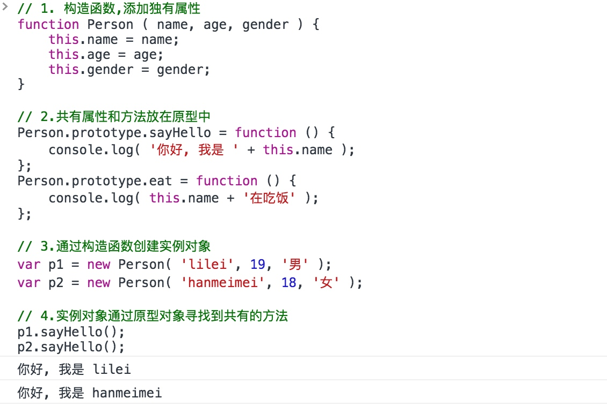

### 直接替换原型对象

	// 1.构造函数,添加独有属性
	function Person ( name, age, gender ) {
		this.name = name;
		this.age = age;
		this.gender = gender;
	}
	// 2.共有属性和方法放在原型中(替换原型对象)
	Person.prototype = {		
		sayHello: function () {
			console.log( '第二种做法: 你好, 我是 ' + this.name );
		}, eat: function () {
			console.log( '第二种做法: ' + this.name + ' 在吃饭' );
		}
	};

	// 3.通过构造函数创建实例对象
	var p1 = new Person( 'lilei', 19, '男' );
	var p2 = new Person( 'hanmeimei', 18, '女' );
	
	// 4.实例对象通过原型对象寻找到共有的方法
	p1.sayHello(); 
	p2.sayHello();

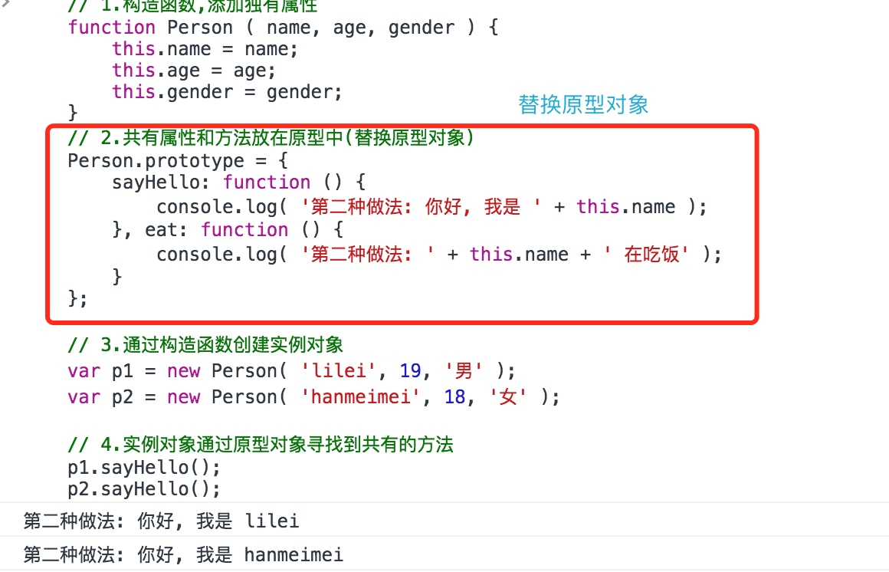

### `constructor`属性

> **原型对象中都有一个`constructor`属性,该属性指向的是当前对象的构造函数**

- 直接给原型对象添加成员,`constructor`依旧指向原构造函数

- 替换原型对象,则替换后的原型对象中没有`constructor`属性,需要手动添加

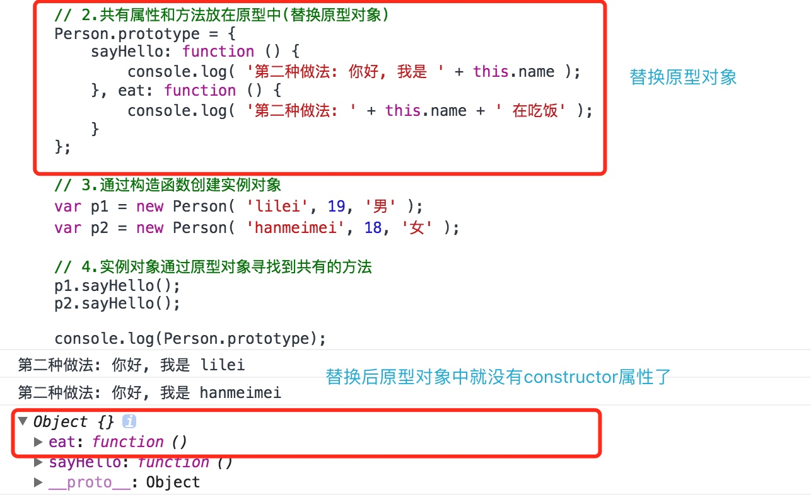

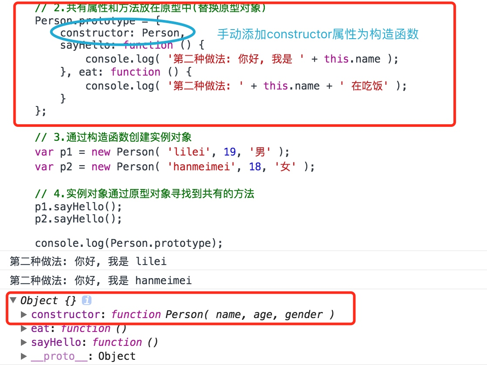

## 原型结构图

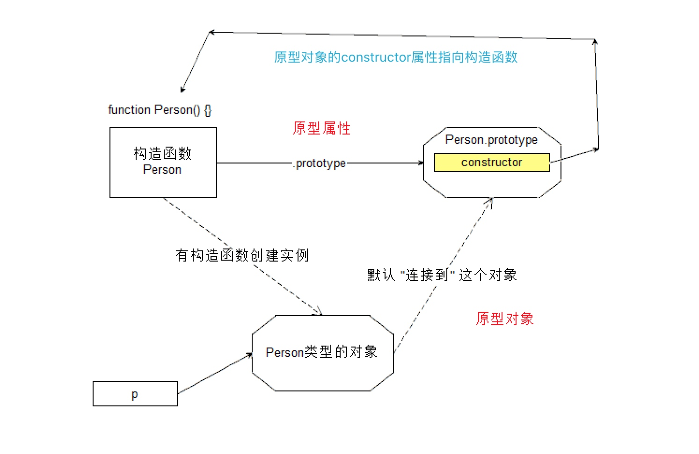

## 原型`__proto__`

> 使用**构造函数**, 就使用 **`prototype`** 属性访问原型
  使用**实例对象**, 就使用 非标准的 **`__proto__`** 属性访问原型
  但实际上访问的都是同一个对象,即原型对象

### 兼容低版本浏览器支持__proto__

	// 低版本浏览器可能不支持__proto__方法 但肯定可以通过构造函数访问prototype
	// 所以可以通过实例对象的constructor属性先访问到构造函数,
	// 再通过构造函数访问到prototype,从而实现实例对象访问原型对象
	
	function __getProto__(instance){
		return instance.constructor.prototype;
	}
	
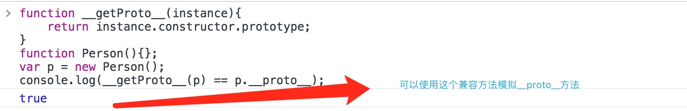

## 继承

> **JS的继承:利用对象的动态特性添加成员, 或直接替换对象的方式修改原型链结构.
> 使得当前对象的原型链上的对象具有某些成员. 那么当前对象就可以使用这些成员从而实现继承的关系.**

### 原型式继承

> 原型与实例对象
> 在 js 中, 方法定义在原型对象中, 而属性定义在实例对象中
> 调用方法的时候, 实例对象本身是没有该成员的, 但是依旧可以调用
> 该方法, 好像这个方法就是该实例对象的一样. 因此, 我们称该**实例对象**继承自**原型对象**
> **任何一个实例对象, 都是继承自其原型对象的, 即原型式继承.**

#### 相关概念
	        		
| 概念 | 其他语言 | JavaScript |
| --- | --- | --- |
| 类 class | 模板 | 构造函数, 类名就是构造函数名 |
| 子类 subclass | 派生的模板 | 原型设置为指定对象的构造函数 |
| 实例 instance | 某个类的对象 | 构造函数创建的对象 |
| 实例成员(实例方法, 实例属性) | 对象的方法和属性 | 对象的方法和属性 |
| 静态方法 | 类方法 | 直接绑定在函数上的方法 |
| 静态属性 | 类属性 | 直接绑定在函数上的属性 |

#### 属性访问原则(重点)

> 1. 对象在调用方法或访问属性的时候, 首先在当前对象中查询. 如果有该成员直接使用并停止查找.
> 2. 如果没有该成员就在其原型对象中查找. 如果有该成员则使用, 并停止查找.
> 3. 如果还没有就到 该对象的 原型对象 的 原型对象中查找.
> ...
> 4. 最后会查到 Object.prototype 上. 如果还没有则 返回 undefined.

	function Person ( name, age, gender ) {
		this.name = name;
		this.age = age;
		this.gender = gender;
	}
	Person.prototype.name = 'itcast';
	var p = new Person( '李雷', 19, '男' );
	console.log( p.name );

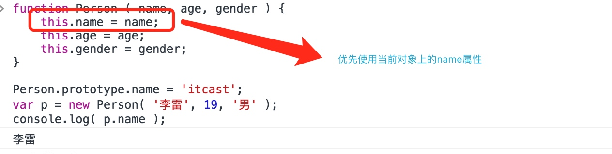

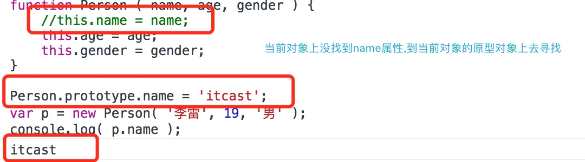

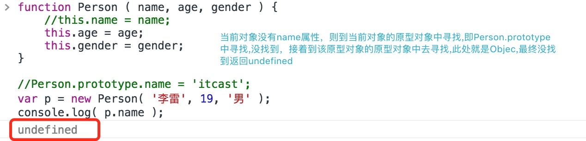

#### 使用对象修改原型对象属性

> 使用对象无法直接修改原型对象中的属性值,因为根据对象的动态特性会直接给当前对象添加一个同名属性并赋值,并不会修改原型对象中的属性值 

	function Person () {
	}
	// 原型中添加name属性
	Person.prototype.name = 'itcast';
	// 创建实例对象
	var p = new Person();
	console.log( p.name );
	
	p.name = 'itheima';
	// 此处看似在做修改,实则根据对象的动态特性会给实例对象p添加一个
	// name属性,并赋值‘itheima’,根本就不会影响到原型对象中的name属性
	console.log( p.name );
	
	// 重新创建一个对象
	var p1 = new Person();
	console.log( 'p1: ' + p1.name );// 继续使用原型对象中的name属性

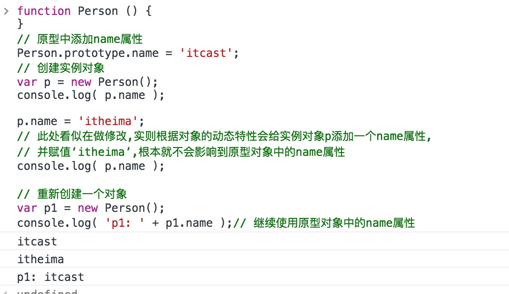

### 混入式继承

> 使用赋值操作,可以将对象1中的属性添加到对象2上,使得对象2既具有自身的属性又具有对象1的属性,这种方式叫做混入式继承

	function __mix__ ( obj, obj1 ) {
		// 遍历obj1,将obj1中所有的属性添加到obj上
		for ( var k in obj1 ) {
			obj[ k ] = obj1[ k ];
		}
	}
	var o1 = { name: '张三', age: 19 };
	var o2 = { gender: '男' };
	__mix__( o2, o1 );
	console.log(o2);// 此时的o2即完成了混入式继承,既具有自身属性又具有o1的所有属性

#### 混入式继承-扩展

> `__mix__`一般代表私有方法,`extend`代表扩展方法
> 这里只是将混入式继承作为一个对象的方法,可以直接使用对象调用这样的混入方法实现继承

	var o = {
		extend: function ( obj ) {
			// 将 obj 中的成员 加到 当前对象 this 上
			for ( var i = 0; i < arguments.length; i++ ) {
				for ( var k in arguments[ i ] ) {
					this[ k ] = arguments[ i ][ k ]; 
				}
			}
		}
	};
	
	o.extend({
			name: '李四'
		}, {
			age: 19,
			gender: '男'
		}, {
			sayHello: function () {
				console.log( 'Hello JS' );
			}
	});

### 混合式继承

> 混合式继承就是将多个对象的各个功能混合到一起, 加到构造函数的原型对象上.那么该构造函数创建的实例 就继承自多个对象了.实际上是原型继承和混入继承的结合。

	function Person () {}
	
	// 给原型对象添加混入方法
	Person.prototype.extend = function ( obj ) {
		for ( var k in obj ) {
			this[ k ] = obj[ k ];
		}
	};
	var p = new Person();
	
	// 继承
	Person.prototype.extend( { 
		sayHello: function () { 
			console.log( '你好, 我是新加的' )
		}, 
		walk: function () {},
		eat: function () {}
	} );
	
	p.sayHello();

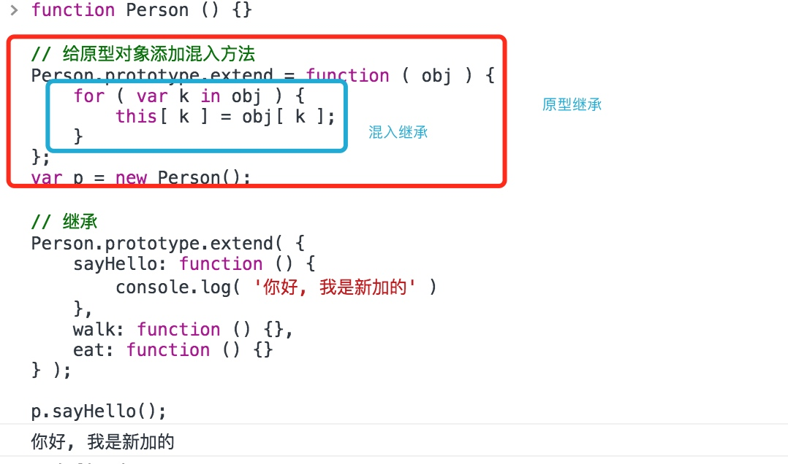

### Object.create()实现继承

> 创建对象调用`var obj = Object.create(o)`,则创建的对象obj的原型对象就是参数对象o

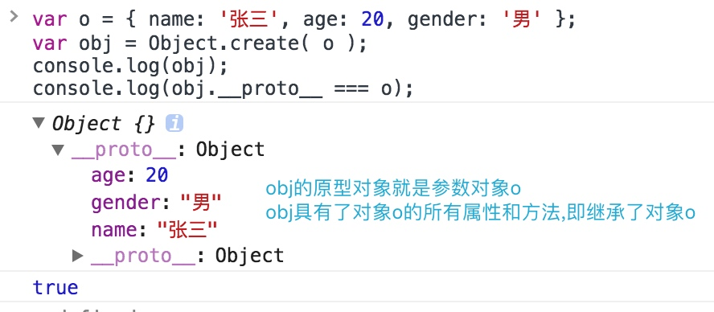

#### 实现原理

	Object.create = function ( o ) {
		function F() {}
		F.prototype = o;
		return new F();
	};
	
#### 兼容写法

	// 这种写法也可以实现兼容,但是因为是直接给内置对象添加方法,不利于后期维护
	if ( !Object.create ) {
			Object.create = function ( o ) {
			function F() {}
			F.prototype = o;
			return new F();
		};
	}
	/*************************************/
	
	// 通用兼容函数
	function createWithObject ( obj ) {
		// 先判断系统是否支持原生的方法,如果支持则使用原生方法
		if ( Object.create ) {
			return Object.create( obj );
		} else {
			function F() {}
			F.prototype = obj;
			return new F();
		}
	} 

# 原型链

## 什么是原型链?

> 因为原型对象也是一个对象,只要是对象就会存在自己的原型对象,所以原型对象也有自己的原型对象,通过这样一级一级查找出的原型,就叫做对象的原型链

	function Person () {}
	// 一旦定义了函数, 那么就有两个部分: 构造函数, "神秘"对象Person.prototype

	// 实例对象p
	var p = new Person();
	
	// 原型链:p --> Person.prototype( p.__proto__ ) --> Object.prototype --> null

> `Person.prototype` 是 实例 p 的原型对象, 使用 `__proto__ `可以访问对象的原型对象
> `Person.prototype` 的 原型对象是 `Person.prototype.__proto__`
> `Person.prototype.__proto__` 里的 `constructor` 是 `Object`. 所以`Person.prototype.__proto__` 就是 `Object.prototype`
> `Object.prototype.__proto__` 是 null. 因此表明 `Object.prototype` 就是顶级.

## 对象的原型链

### 普通实例对象的原型链结构图

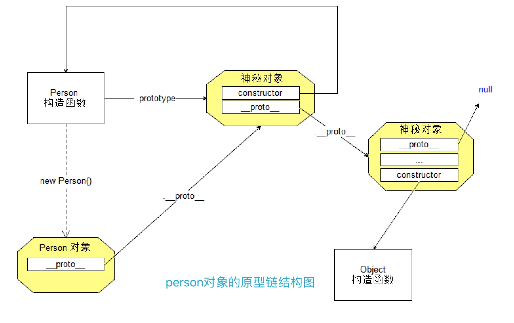

### 内置对象的原型链

	// 数组
	[] --> Array.prototype --> Object.prototype --> null
	// 正则
	/./ --> RegExp.prototype --> Object.prototype --> null 
	// 时间
	new Date() --> Date.prototype --> Object.prototype --> null 
	// 对象
	{} --> Object.prototype --> null

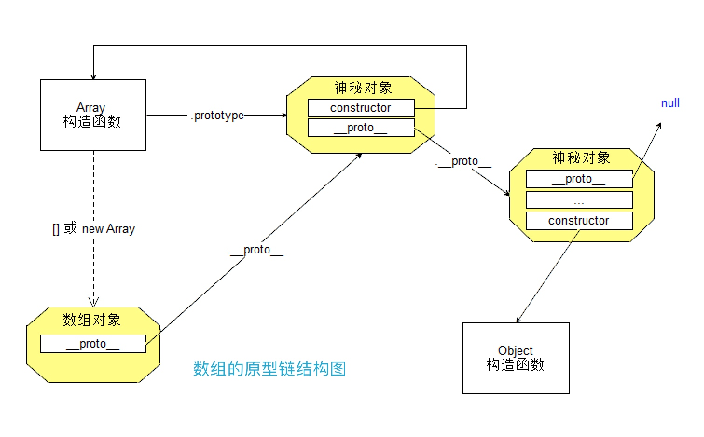

### 原型链结构练习

	// 根据这段代码画出stu的原型链结构图 
	function Person( name, age, gender ) {
		this.name = name;
		this.age = age;
		this.gender = gender;
	}
	function Student () {}

	Student.prototype = new Person( '张三', 19, '男' );

	var stu = new Student();

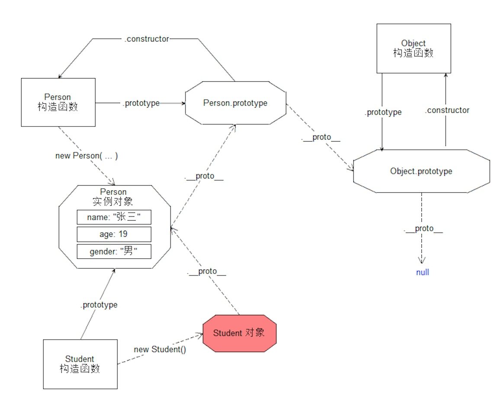

	// 画出p1 p2的原型链结构
	function Person() {}
	var p1 = new Person();
	var p2 = new Person();

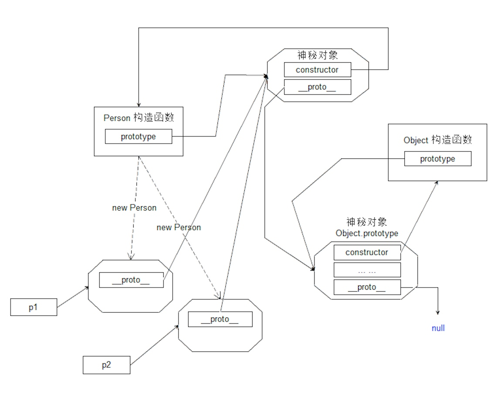

## Function与动态函数

### 动态函数

> 动态函数就是在运行的过程中, 将一段字符串作为代码运行.由于字符串可以随意的拼接. 因此得到动态的执行.

#### 创建动态函数

- 语法

		new Function(arg0,arg1,...argN,functionBody);
	
		// Function的所有参数中,除了最后一个以外,都是生成的函数的参数,最后一个是生成函数的函数体

- 案例

		// 案例1: 求两个数字的和
		// 传统做法
		function getSum ( num1, num2 ) {
			return num1 + num2;
		}
	
		// 动态函数
		var getSum2 = new Function ( 'num1', 'num2', 'return num1 + num2;' ); 
	
		console.log(getSum2( 123, 456 ));
		
### 函数的相关参数

#### arguments

> 凡是函数调用, 都会默认含有一个 `arguments` 对象. 可以将其看做为 "数组". 里面存储着调用时传入的所有参数. 可以使用数组的索引访问这些参数.

	// 求和
	function sum () {
		// 所有的参数都会存储到 arguments 中
		var sum = 0;
		for ( var i = 0; i < arguments.length; i++ ) {
			sum += arguments[ i ];
		}
		return sum;
	}
	console.log( sum( 1, 4, 2, 7, 5, 9 ) );

- 改写extend函数

		// 混入式继承
		function extend() {
			var args = arguments;
			if ( args.length == 1 ) {  				// 混入到 this 中
				for ( var k in args[ 0 ] ) {
					this[ k ] = args[ 0 ][ k ];
				}
			} else {									// 混入到 argu...[ 0 ] 中
				for ( var k in args[ 1 ] ) {
					args[ 0 ][ k ] = args[ 1 ][ k ];
				}
			}
		}

#### length

> 定义函数时形参的个数,通过函数名.length访问

#### name

> 函数名,通过函数名.name访问

### 函数的引用

> js中的函数也是一个对象
> `callee` 在函数内部,表示当前函数的引用
> `caller` 表示调用函数的函数

#### callee:当前函数的引用

	// 1. callee
	// 语法: arguments.callee 
	//	当前函数的引用
	/*
	function foo () {

		console.log( arguments.callee === foo );
	}

	foo();
	// 一般在函数内部, 实现函数递归的时候, 我们一般使用 callee 表示函数的引用

	// 传统的递归方法
	function fn () {
		fn(); // 自己调用自己
	}
	fn();

	// 新的方法
	function fn() {
		arguments.callee();  // 使用 callee 来递归
	}
	fn();
	*/

#### caller:调用该方法的函数 的 调用函数

	// 2. caller 表示调用函数
	// 语法: 函数名.caller
	function f2 () {
		console.log( f2.caller ); 
	}

	function itcast() {
		f2();	
	}

	itcast();

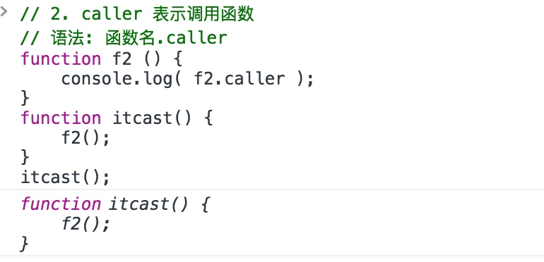

### evel函数

> 直接将字符串当做代码执行
> 通过`evel`函数执行的代码中的变量会和当前代码处于同一作用域,**谨慎使用**

	eval( 'var num = 123;' );
	eval( 'console.log( num );');

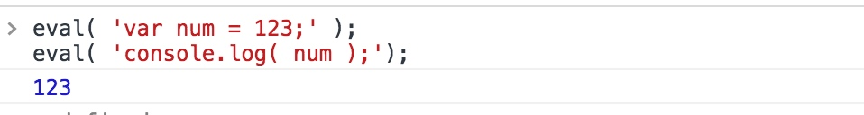

### json字符串转换为对象

	// 1. eval 做法
	var o1 = eval( "(" + data + ")" );   // 注意一个习惯. 就是数据两端一般加上圆括号为好

	// 2. Function 做法
	var o2 = (new Function( 'return ' + data ))();

	// 3. 使用 ES5 中引入的标准处理 JSON 的语法
	// JSON.parse(  )
	// 注意: 字符串必须是严格是 json 格式
	var o3 = JSON.parse( data );

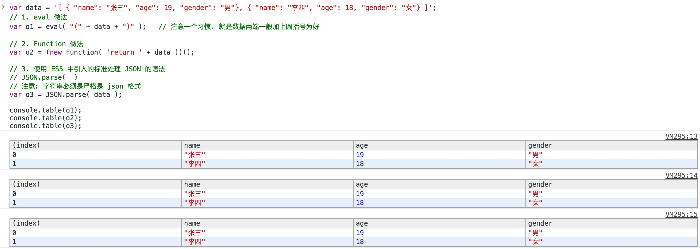

## 函数的原型链

### 函数是Function的实例

> 函数也是一个对象,`Function`是函数的构造函数

### Function是Function自己的实例

> Function本身就是一个函数,而函数是Function的实例,所以说Function是Function自己的实例

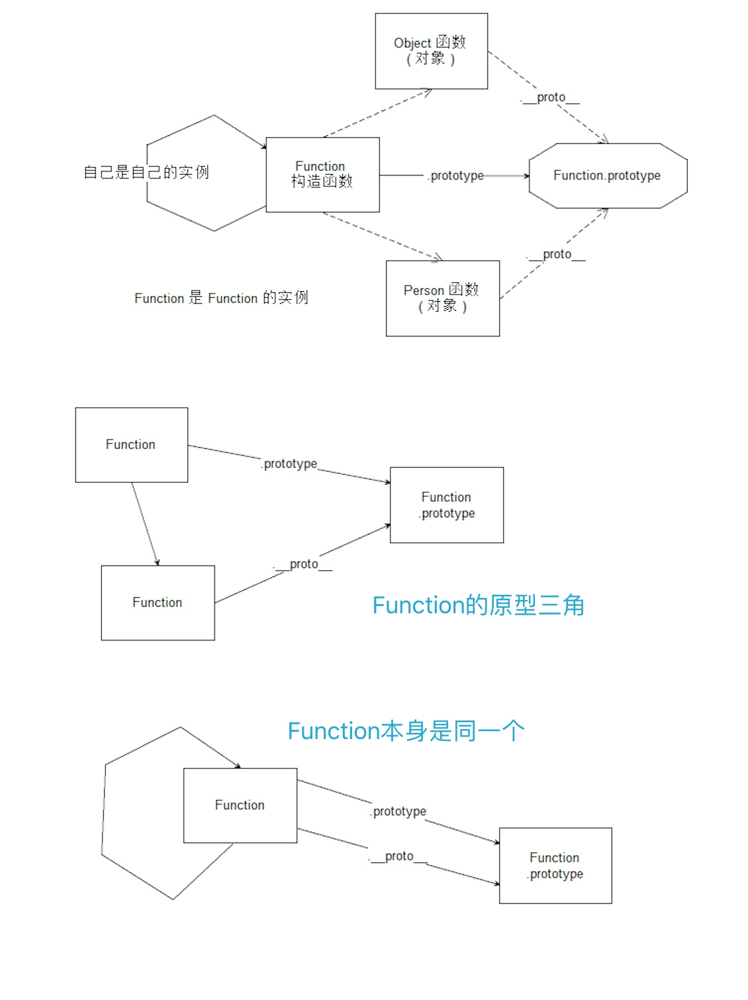

### 函数的原型链

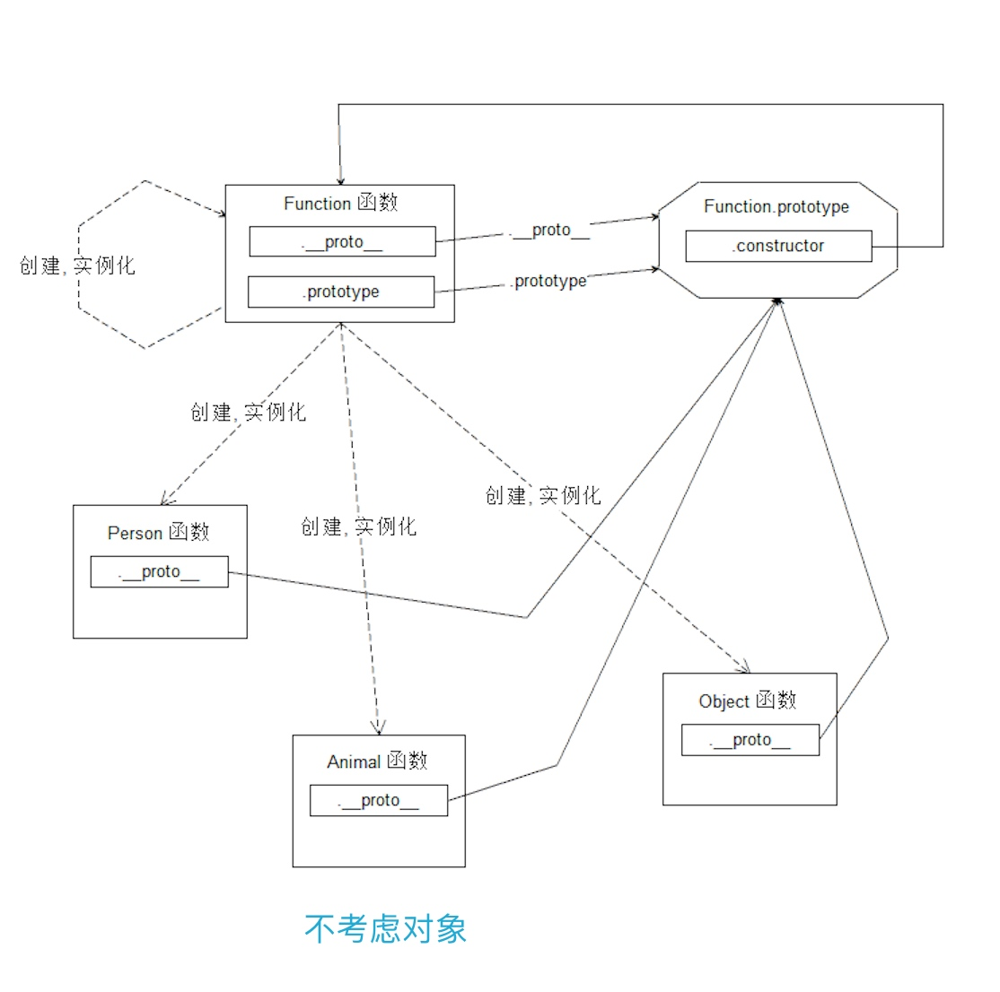

### 函数和对象完整原型链

## instanceof语法

> ~~判断该对象是否为 构造函数 的 实例~~
> ==判断 构造函数的 原型属性 是否在对象的原型链上==

	function Person () {}
	
	var p1 = new Person();
	// 按照原有的原型结构来创建
	// p1 -> 原来的 Person.prototype -> Object.prototype -> null

	// 设置原型
	Person.prototype = {}; 

	console.log( p1 instanceof Person );   // 判断 {} 是否在 p1 的原型链上

	function Person () {}

	// 设置原型
	Person.prototype = {}; 

	var p1 = new Person();
	// 按照现在的原型链创建
	// p1 -> 新的 Person.prototype. 即 {} -> Object.prototype -> null

	console.log( p1 instanceof Person );   //判断 {} 是否在 p1 的原型链上

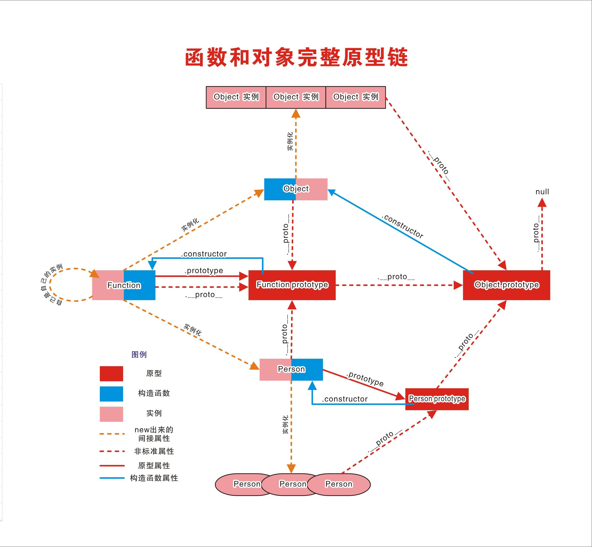

# 作用域链

## 预解析的概念
### 什么是预解析
> js代码在执行之前,对代码进行的翻译解释,可以减少代码在执行时出现异常

### 为什么需要预解析

#### 编译性语言
> 编译型语言: C, C++, C#, Java ...需要一个 "翻译" 程序, 将源代码翻译成计算机可以读懂的二进制数据( 指令 ).然后存储成可执行文件. 也就是会提前翻译好, 运行时直接执行得到结果

#### 解释性语言
> 解释型( 脚本型 ): JavaScript, SQL, ... 代码在执行的时候, 有一个翻译程序, 读一句代码执行一句代码. 再读一句代码, 再执行一句代码.

#### 为什么需要预解析

> 代码在执行之前, 快速的 "预览" 一遍,对错误部分进行暴露, 那么可以尽可能提高执行时的效率.

## 预解析的特点

> 预解析的过程中完成代码申明部分的标记与变量作用域的设定

### 什么是申明

> 寻找标识符进行标记,使js执行引擎知道当前环境有哪些东西可用

### 变量申明

	语法: 	var 变量名;
	目的: 告诉解释器, 有一个名字是一个变量, 在当前环境中可以被使用.
	
	var a; // 申明变量a 值是undefined
	var b = 123; // 申明变量b 同时在执行时赋值123;
	
#### 申明提升

	if('a' in window){
		var a = 123;
	}
	
	console.log(a);
	
	// 分析:
	//	1.读取所有的代码( 字符串 ). 包含每一个字节, 每一个数据. 但是 "只留意" var
	// 	2.判断 var 后面紧跟的名字是否被标记. 如果没有, 则标记上. 
	//		如果已标记, 则忽略.	表示在当前环境中已经有该变量了.
	// 	3.读取完毕后, 代码再从头开始, 从上往下, 从左至右一句一句的执行代码.
	//		执行 'a' in window. 很显然当前环境中已有变量 a, 所以结果为真.

### 函数申明 

#### 函数的定义形式

- **声明式**:	

		function func () {
			console.log( '使用声明式定义' );
		}
					
- **表达式式( 匿名函数, 字面量函数, lambda 函数 )**:

		var func = function () {
			console.log( '使用表达式式定义' );
		};
		
		/*也可以带有名字*/
		var func = function fn(){
			console.log('表达式式函数');
		};
		
#### 两种形式定义函数的特点

> **函数的声明是独立于语句. 不需要加分号结束. 也不能嵌入到代码表达式中.**
> **函数声明是独立于代码执行的. 代码在执行的时候, 声明部分已在预解析阶段处理完毕.所以可以先调用后申明.**

> **表达式式, 本质上是使用函数表达式( 字面量 )给变量赋值. 因此它是语句.**

#### 表达式定义函数的注意点

	var f1 = function f2 () {
		console.log( '带有名字的  函数表达式' );
		console.log( f2 );
	};

	// 当函数声明语法嵌入表达式环境中, 会自动进行转换, 将转换成函数表达式.
	// 1> 引用函数的规则还是使用变量赋值, 所以外部可以使用该名字调用函数.即可以使用f1调用函数
	// 2> 函数表达式带有名字, 该名字只允许在函数内部使用. 属于局部作用域. ( IE8 除外 )即f2只能在f2函数内部使用
	// 3> 带有名字的函数表达式, 函数的 name 属性即为该名字,即函数的name为f2

### 什么叫表达式

> 1.将运算符与操作数连接起来的式子.

> 2.存在结果的代码单元(不包括语句).
	
	var a;		// 声明, 不是语句, 也没有结果
	123			// 字面量, 有值, 是表达式. 是常量表达式
	a = 123		// 赋值, 有值, 就是被赋值的那个值. 是赋值表达式.
	
### 函数申明和变量申明同时出现的注意点

> 声明变量, 是告诉解释器当前环境可以使用该名字了.

> 声明函数, 是告诉解释器, 除了可以使用该名字, 该名字还表示一个函数体.

#### 先var 后 function

	var num;
	function num(){
		
	}
	console.log(num); // 打印函数体
	
	// 先 var num; 后 function num ...
	// 首先告知解释器有 名字 num 了
	// 后面是函数声明. 由于已经有 num 名字可以使用了, 所以就不再告诉解释器可以使用 num
	// 而是直接将 num 与函数结合在起义.
#### 先function 后 var

	function num(){};
	var num;
	console.log(num); // 打印函数体
	
	// 先 function num ... 后 var num;
	// 一开始已经有 num 了, 而且是函数. 所以后面的 var num; 属于重复声明.

### 特例

	if ( true ) {
		function foo() {
			console.log( true );
		}
	} else {
		function foo() {
			console.log( false );
		}
	}
	foo();
	
	// 在早期的浏览器中( 2015 年前) 所有的浏览器( 除了火狐 )都是将其解释为声明 : false
	// 但是现在的运行结果, 得到: true. 表示 if 起到了作用
	
	/******************************/
	
	if ( true ) {
		function foo1() {
			console.log( true );
		}
	} else {
		function foo2() {
			console.log( false );
		}
	}
	foo1();
	// foo2();  // error: foo2 is not function. 已定义, 但是函数为被指向

	// 好比: var foo1 = function foo1 () { ... }

	// 虽然这两个函数不是声明, 但是也不能解释成函数表达式. 如果是函数表达式 foo1 与 foo2 只能在函数内部使用.

## 词法作用域
### 什么叫作用域

> 变量可以使用 到 不能使用的范围

### js的词法作用域

>  js 的词法作用域, 就是根据预解析规则定义变量的使用范围, 而js只有函数可以限定范围. 其他均不能限定访问范围. 所以实际上词法作用域也可以称作函数作用域.

### 词法作用域特点

> 1. 在代码中只有函数可以限定作用范围. 允许函数访问外部的变量. 反之不允许.
>
> 2. 在函数内优先访问内部声明的变量, 如果没有才会访问外部的.
> 
> 3. 所有变量的访问规则, 按照预解析规则来访问
> 
> 4. js中变量的作用域链与定义时的环境有关，与执行时无关。

### 案例

#### 案例01

	var num = 123;
	function f1 () {
		console.log( num );
	}
	function f2 () {
		console.log( num );
		var num = 456;
		f1();
		console.log( num );
	}
	f2();

	1> 读取代码预解析. 得到 num, f1, f2
	2> 逐步的执行代码
		1) 赋值 num = 123;   注意 f1 和 f2 由于是函数, 所以也有数据.
		2) 调用 f2.
			进入到函数体内. 相当于做一次预解析. 得到 num. 注意, 此时有内外两个 num
			执行每一句代码
			-> 打印 num. 因为函数内部有声明 num. 所以此时访问的是函数内部的 num. 未赋值, 得到 undefined
			-> 赋值 num = 456
			-> 调用 f1(). 调用函数的规则也是一样. 首先看当前环境中是否有函数的声明. 如果有直接使用. 如果没有, 则在函数外面找, 看是否有函数. 此时在函数 f2 中没有 f1 的声明. 故访问的就是外面的 f1 函数
			-> 跳入 f1 函数中. 又要解析一次. 没有得到任何声明.
			-> 执行打印 num. 当前环境没有声明 num. 故在外面找. 外面的是 123. 所以打印 123. 
				函数调用结束, 回到 f2 中.
			-> 继续执行 f2, 打印 num. 在 f2 的环境中找 num. 打印 456.
	
	
#### 案例02

	(function ( a ) {
		console.log( a );
		var a = 10;
		console.log( a );
	})( 100 );

	拆解
	( 函数 ) ( 100 )
	第一个圆括号就是将函数变成表达式
	后面一个圆括号就是调用该函数

	注意: 函数定义参数, 实际上就是在函数最开始的时候, 有一个变量的声明
	function ( a ) { ... }
	其含义就是, 在已进入函数体, 在所有操作开始之前( 预解析之前 )就有了该变量的声明.

	由于已经有了 a 参数的声明. 所以在代码中 var a = 10 是重复声明. 其声明无效.
	所以上面的代码, 等价于
	var func = function ( a ) {
		console.log( a );			// => 100
		a = 10;
		console.log( a );			// => 10
	}
	func( 100 );
	
#### 案例03

	(function ( a ) {
		console.log( a );
		var a = 10;
		console.log( a );
		function a () {
			console.log( a );
		}
		a();
	})( 100 );

	1> 直接调用
	2> 进入到函数中, 已有声明 a 并且其值为 100
	3> 在函数内部预解析. 得到 一个结论. 函数声明是两个步骤. 
		1) 让当前环境中, 有变量名 a 可以使用. 但是不需要. 因为已经有 a 的声明了
		2) 让 a 指向函数. 相当于
			var a;
			function a () {}
			...
	4> 开始逐步执行每一句代码
		1) 打印 a. 所以打印函数体
		2) 赋值 a = 10
		3) 打印 a, 打印出 10
		4) 调用 a, a已经被赋值为10,不在是函数体, 所以报错 error: a is not function
			
## 作用域链

> 链其实指的一种访问规则,作用域链就是指作用域的访问规则

### 绘制作用域链的规则

	1. 将所有的 script 标签作为一条链结构. 标记为 0 级别的链.
	2. 将全局范围内, 所有的声明变量名和声明函数名按照代码的顺序标注在 0 级链中.
	3. 由于每一个函数都可以构成一个新的作用域链. 所以每一个 0 级链上的函数都延展出 1 级链.
	4. 分别在每一个函数中进行上述操作. 将函数中的每一个名字标注在 1 级链中.
	5. 每一条 1 级链中如果有函数, 可以再次的延展出 2 级链. 以此类推...

### 分析代码执行

	1. 根据代码的执行顺序( 从上往下, 从左至右 )在图中标记每一步的变量数据的变化
	2. 如果需要访问某个变量. 直接在当前 n 级链上查找变量. 查找无序.
	3. 如果找到变量, 直接使用. 如果没有找到变量 在上一级, n - 1 级中查找.
	4. 一直找下去, 直至到 0 级链. 如果 0 级链还没有就报错. xxx is not defined.

### 经典面试题

	var  arr = [ { name: '张三1' }, 
				 { name: '张三2' }, 
				 { name: '张三3' }, 
				 { name: '张三4' } ];

	// 利用循环, 添加方法, 在方法中打印 name
	for ( var i = 0; i < arr.length; i++) {
		// arr[ i ] 绑定方法
		arr[ i ].sayHello = function () {
			// 打印名字
			console.log( 'name = ' + arr[ i ].name );
		};
	}

	for ( var i = 0; i < arr.length; i++ ) {
		arr[ i ].sayHello();
	}

	// 打印结果?

# 闭包

## 闭包的概念

### 什么是闭包

> **闭包**其实就是指**函数**所构成的一个外部无法直接访问的区域,其具有变量作用域隔离特性.
> 
> **本质:利用作用域访问规则的不可逆性,构成一个单向空间.**

### 闭包解决的问题

> 因为外部环境不能直接访问函数内部的变量,所以闭包用来解决的问题就是:**间接的访问函数内部被隔离的数据.**

### 闭包的间接访问

> 利用函数的返回访问函数内部被隔离的原始数据

	function foo () {
		var num = Math.random();   // 原始数据
		
		function func () {
			return num; // 原始数据 num
		}

		return func;
	}
	var f = foo(); 	// foo 只调用一次, 就可以创建一个原始数据, 但是返回的函数可以重复调用
					// 每调用一次就是在获得闭包中的数据的值
	var v1 = f();
	console.log( v1 );
	var v2 = f();
	console.log( v2 );

## 函数作为数据来使用

> 函数是基本的对象类型. 可以作为变量赋值, 可以作为参数使用, 也可以作为返回值使用

### 函数可以被赋值

	// 1.赋值
	function foo () {
		console.log( 'Hello World' );
	}
	var func = foo;
	// 函数体只有一个, 是将 函数的引用 赋值给了 func
	// 因此 func 和 foo 指向同一个函数, 也可以调用该函数
	foo();
	func();
	
	// 2.赋值扩展
	function foo () {
		console.log( 'Hello World' );
	}
	var arr = [];
	arr[ 0 ] = foo();
	arr[ 1 ] = foo();

	arr[ 0 ]();
	arr[ 1 ]();

### 函数可以作为参数进行传递

	function f1 ( val ) {
		console.log( val );
	}
	
	// 函数也是一个对象
	function func () {
		console.log( '我是一个函数' );
	}

	f1( func ); // 函数名存储的函数引用, 因此将函数作为参数传递时, 直接传递函数名即可

	// 直接传递匿名函数
	f1( function () {
		console.log( '我是一个函数表达式, 作为参数传入' )
	} );
	
	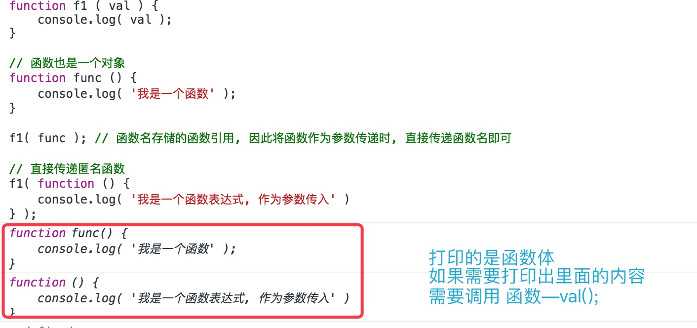

	
#### 回调函数

> 作为参数传递的函数叫做回调函数
> 
> 回调函数可以直接调用

	function foo ( fn ) {
		// 调用
		// 如果 fn 是函数, 就调用
		if ( typeof fn === 'function' ) {
			fn();
		} else {
			console.log( '参数不是函数, 是: ' + fn );
		}
	}

	function func1 () {
		console.log( '我是一个函数声明' );
	}
	var func2 = function () {
		console.log( '我是一个函数表达式' );
	};

	foo( func1 );
	foo( func2 );
	foo( function () {
		console.log( '我是一个匿名的函数表达式' );
	} );

	foo( 123 );
	foo( true );
	foo( {} );
	

### 函数作为返回值使用

	function foo () {
		function func () {
			console.log( '我是一个嵌入在 函数内部的 函数' );
		}

		return func;
	}

	var f = foo();

	f();

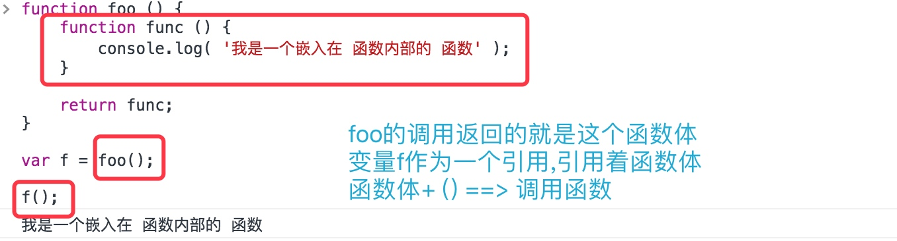

	foo()();

	function foo () {
		return function () {
			console.log( '我是一个直接写在 return 后面的函数' );  
		};
	}

## 闭包的应用

### 操作函数中多个变量

	function foo () {
		var num1 = 123, num2 = 456;
		return {
			get_num1: function () {
				return num1;
			},
			set_num1: function ( value ) {
				num1 = value;
			},
			get_num2: function () {
				return num2;
			}
		};
	}

	var o = foo();

	console.log( 'num1 = ' + o.get_num1() );
	console.log( 'num2 = ' + o.get_num2() );

	o.set_num1( 789 );

	console.log( 'num1 = ' + o.get_num1() );
	console.log( 'num2 = ' + o.get_num2() );

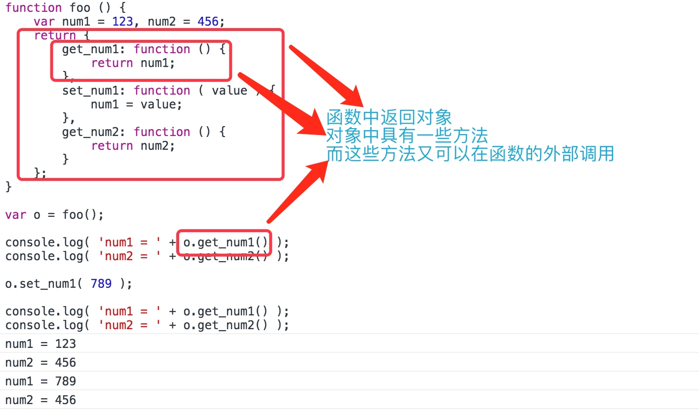

### 利用闭包实现私有数据

	function createPerson ( name, age, gender ) {
		var hasChangeGender = false;
		return {
			get_Name: function () {
				return name;
			}, set_Name: function ( value ) {
				name = value;
			}, get_Age: function () {
				return age;
			}, get_Gender: function () {
				return gender;
			}, set_Gender: function ( value ) {
				if ( hasChangeGender == false ) {
					gender = value;
					hasChangeGender = true;
				} else {
					throw new Error( '已经改变过一次性别了, 不能再修改了' );
				}
			}
		};
	}

	var p1 = createPerson( '张三', 19, '男' );

	console.log( 'p1.name = ' + p1.get_Name() );
	console.log( 'p1.age = ' + p1.get_Age() );
	console.log( 'p1.gender = ' + p1.get_Gender() );

	p1.set_Name( '王二' );
	p1.set_Gender( '女' );

	console.log( 'p1.name = ' + p1.get_Name() );
	console.log( 'p1.age = ' + p1.get_Age() );
	console.log( 'p1.gender = ' + p1.get_Gender() );

	p1.set_Name( '王三' );
	p1.set_Gender( '男' );

### 闭包的核心技术

#### 带有私有数据的函数

	function foo () {
		var num = 123;
		return function () {
			// 可以访问 num
		}
	}
	var func = foo();
	// 称 func 是一个 带有私有数据的 函数
	// 称 func 带有缓存
	
#### 带有私有数据的 对象

	function foo () {
		var num = 123;
		return {
			// 私有数据
		}
	}
	var func = foo();
	// 称func 是一个 带有私有数据的 对象

#### 沙箱模式

> 沙箱模式:隔离的执行环境

	(function () {
		// 沙箱模式

		// 所有的代码写在这里

	})();
	
	// 沙箱内变量外界无法直接访问,不会影响到外界,同时也是私有数据

#### 模拟onload事件的追加与移除

	var itcastload = (function () {

		// 私有数据
		var data = [];
		
		// 由于要求系统在调用 load 的时候, 执行这个数组中的所有方法
		// 因此需要手动实现 onload 的功能
		window.onload = function () {
			// 依次执行 数组中的 方法
			for ( var i = 0; i < data.length; i++ ) {
				data[ i ]();
			}
		};

		return {
			addEvent: function ( fn ) {
				data.push( fn );
			}, removeEvent: function ( fn ) {
				// 删除 fn
				// 遍历 data, 发现与 fn 相同的就删除

				// 给定一个数组, 删除里面的元素
				// arr.splice( 从第几个元素开始, 一共删除多少个元素 )
				// 删除以后 arr.length 就发生变化了
				// 倒过来循环
				for ( var i = data.length - 1; i >= 0; i-- ) {
					if ( data[ i ] === fn ) {
						data.splice( i, 1 );
					}
				}
			}
		};
		
	})();

#### 利用闭包模拟一个缓存结构

	var cache = (function () {
		var data = [], max = 3;
		// 去掉 var 的目的是为了使得变量编程全局变量, 可以调试查看 data 中的数据
		// 开发中不允许省略 var

		function cache ( key, value ) {

			// 做判断, 如果超出范围, 则, 将最开始加入的 移除 
			// 将数组 第 0 项元素移除的 splice, shift
			if ( data.length >= 3 ) {
				// 需要先移除
				var temp = data.shift();
				delete cache[ temp ];
			} 

			data.push( key );

			cache[ key ] = value;
		}
		return cache;
	})();

	cache( 'name1', '张三' );
	cache( 'name2', '李四' );
	cache( 'name3', '王五' );
	cache( 'name4', '找钱' );

# 函数的四种调用模式

## 函数模式

### 函数的定义方式
- 申明式
		
		function fn(){}
		
- 表达式式

		var fn = function(){};
		
- Function

		var fn = new Function();
		
### 函数模式调用函数

- **调用方式**:`函数名(参数)`

		fn();

- **函数模式**调用下的`this`:**函数模式**下的`this`对象就是`Window`对象

- **特例**:任何自调用函数(立即执行函数)都是**函数模式**
	
		// 自调用函数
		(function(){
			console.log(this);
		})();
		
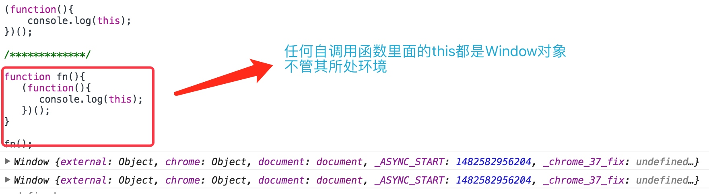

		
## 方法模式

- **概念**: 方法本身就是函数,但是方法不是单独独立的调用,而是通过一个对象引导调用
- 调用方式:`对象.方法名(参数)`

		var o = {};
		o.fn = function(){
			console.log(this);
		};
		o.fn();
		
- **方法模式**调用下的`this`:**方法模式**调用下的`this`就是引导调用该方法的对象

- **注意**

	> 方法调用一定要有**宿主对象**。方法一定是某个对象的方法,此对象可以是**任何对象**。
	

### 面试题

	var length = 10;
	function fn() {
		console.log( this.length );
	}
	var obj = {
		length: 5,
		method: function ( fn ) {
			fn();
			arguments[ 0 ]();
		}
	};
	obj.method( fn, 1 );
	
	// 结果: 10 2
	// 分析:
	// 1. 第一个fn()很明显是函数调用模式,内部this指向window对象,
		所以window.length指的就是全局变量length 打印10
	// 2. 第二个arguments[ 0 ](): arguments是伪数组对象,arguments[ 0 ]里面是第一个参数,
		即传入的函数体,arguments[ 0 ]() 开始调用函数.相当于伪数组对象的第0项绑定的是一个函数,
		所以调用该函数时,里面this指向的宿主对象就是伪数组arguments,
		而arguments正好有length属性,代表的是传入实参的个数,所以打印2
	

	
## 构造器模式

- **调用方法**:使用`new`关键字引导

		function Person(){
			this.name = 'zs';
			this.age = 18;
			this.gender = '男'
		};
		
		// 构造器模式调用
		var p = new Person();
- **执行步骤**:

	1. 使用`new`运算符申请创建对象
	2. 创建出来的对象传递给构造函数的`this`
	3. 使用构造函数对其进行初始化
	
			使用new 创建对象 和 {} 基本一样,只是原型链结构不同
			
			{}: 对象.__proto__ === Object.prototypr
			new 构造器(): 对象.__proto__ === 构造器.prototype
- **返回值**:

	- 如果不写`return`语句,那么 构造函数 默认返回`this`
	- 如果构造函数中写上`return`,并紧跟**基本类型**,则忽略基本类型数据,返回`this`
	
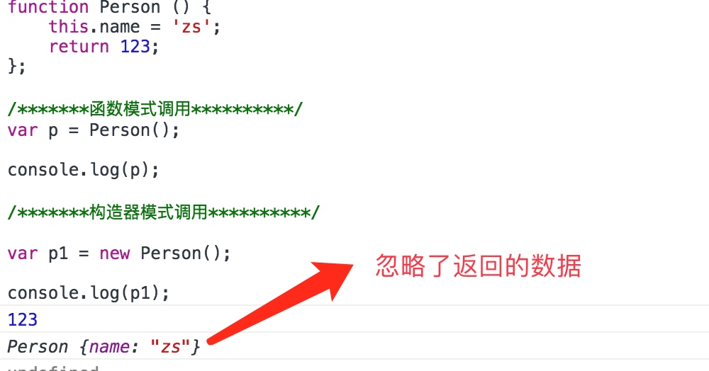

- 如果构造函数中写上`return`,并紧跟**引用类型**,则构造函数返回该引用类型数据,忽略`this`

### 面试题

	function Foo() {
		getName = function(){ alert(1); };
		return this;
	}	

	Foo.getName = function() { alert(2); }; // Foo绑定了getName
	Foo.prototype.getName = function() { alert(3); }; // Foo原型绑定了getName
	var getName = function() { alert(4); }; // 全局getName 绑定了函数
	function getName() { alert(5); } 

	/******************************************/

	Foo.getName(); // 2
	// Foo的静态方法getName
	
	getName(); // 4
	// 全局对象下的方法getName
	
	Foo().getName(); // 1
	// 1. 给getName重新赋值,因为函数内部没有getName,所以修改的是全局getName
	// 2. Foo函数调用模式 内部返回的this是window 
	// 3. 所以最终相当于 window.getName() === > 1
	
	getName(); // 1
	// 全局对象下的方法getName
	
	new Foo.getName(); // 2
	// Foo的静态方法getName 使用new构造函数模式调用
	
	new Foo().getName(); // 3 
	// 1. 先 new Foo();
	// 2. 然后调用new出来的对象的getName方法
	// 3. n查找到实例对象的原型中的getName ==> 3
	
	new new Foo().getName(); // 3
	// ==> new (new Foo()).getName()
	// 1. new Foo() ==> Foo的实例对象(假设叫f)
	// 2. 实例对象f的getName属性 ==> 查找到了原型中的函数 即f.getName === function() { alert(3); }
	// 3. new f.getName() ==> new function() { alert(3); }() ==> 构造函数模式调用
	
- 结合性:

		1> 如果构造函数没有参数, 可以省略 圆括号
			var p = new Person;
		2> 如果希望创建对象并直接调用其方法
			( new Person () ).sayHello()
			-> 可以省略调整结合性的圆括号
				new Person().sayHello()
			-> 如果想要省略构造函数的圆括号, 就必须添加结核性的圆括号
				(new Person).sayHello()
	
## 上下文模式

> 概念: 在不同环境下的不同调用模式,就是统一一种格式,可以实现函数调用模式和方法调用模式

> 目的: 借用方法

### apply形式

#### 基本使用

- 语法:`函数名.apply(参数)`

		function foo () {
			console.log( this );
		}

		var o = { name: 'zs' };

		// 如果需要让函数以函数模式调用, 可以使用
		foo.apply( null ) 或 foo.apply()
		
		// 如果希望方法模式调用, 需要提供一个宿主对象
		foo.apply( o );

- 特点: 使用这种方式调用,不会污染宿主对象,即不需要宿主对象必须包含该方法

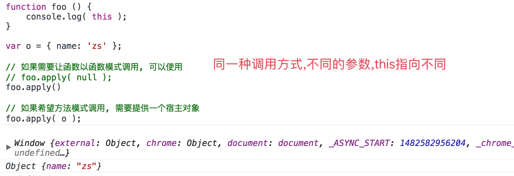

#### 带参数的函数使用apply调用

> 使用 apply 进行调用, 如果函数是带有参数的. apply 的第一个参数要么是 null 要么是对象

> 如果是 null 就是函数调用, 如果是 对象就是 方法调用, 该对象就是宿主对象.
> 后面紧跟一个数组参数, 将函数的参数依次放在数组中.

	function foo ( num1, num2 ) {
		console.log( this );
		return num1 + num2;
	} 

	// 函数调用模式
	// var res1 = foo( 123, 567 );

	// 方法调用
	var o = { name: 'jim' };
	// o.func = foo;
	
	// var res2 = o.func( 123, 567 );

	// 改写成 apply 形式
	var res1 = foo.apply( null, [ 123, 567 ] ); // 函数调用
	var res2 = foo.apply( o, [ 123, 567 ] ); // 方法调用
	
#### 案例

	var t = document.getElementsByTagName, 
		arr = [];
	
	arr.push.apply( arr, t.apply( document,  [ 'p' ] ) );

	arr.push.apply( arr, t.apply( document,  [ 'div' ] ) );
	
	// 借用数组的push方法
	// arr.push是组数的方法 ==> 相当于定义了一个函数 function push(){} 这个函数是具有数组push一样的功能
	// 然后用这个函数调用apply方法,只不过这个函数毕竟是数组的方法,所以宿主对象是数组
	

### call形式

> 使用 call 进行调用, 如果函数是带有参数的. call 的第一个参数要么是 null 要么是对象

> 如果是 null 就是函数调用, 如果是 对象就是 方法调用, 该对象就是宿主对象.
> 后面紧跟一个函数的所有参数,使用逗号分隔(**和apply功能一模一样,唯一区别就是传参形式不同)**

	function foo ( num1, num2 ) {
		console.log( this );
		return num1 + num2;
	} 
	var o = { name: 'jim' };

	// 改写成 call 形式
	var res1 = foo.call( null, 123, 567 ); // 函数调用
	var res2 = foo.apply( o, 123, 567 ); // 方法调用

## call(apply)形式借用构造函数实现继承

	function Person ( name, age, gender ) {
		this.name = name;
		this.age = age;
		this.gender = gender;
	}

	function Student ( name, age, gender, course ) {

		Person.call( this, name, age, gender );
		// Person.apply( this, [name, age, gender] );

		this.course = course;
	}

	var p = new Student ( 'jim', 19, 'male', '前端' );

## 其他补充知识

### bind绑定函数调用的对象实现方法调用

> 使用 `函数.bind(对象)` 会返回一个函数,调用返回的函数,实现 对象调用方法 的效果

	function fn(){
 		 console.log(this);
	};

	var o = {
	  name:'zs',
	};

	var f = fn.bind(o); // 给函数fn绑定了对象

	f(); // 虽然是函数调用模式,但是打印的this是绑定的对象,实现了函数的方法调用模式

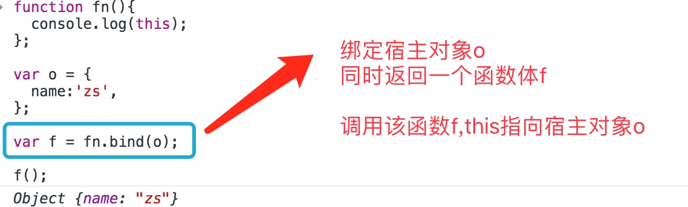

### Object.prototype成员介绍

- `constructor`:指向构造函数
- `hasOwnProperty`:判断属性是否为对象自己所拥有(即不包括原型链上的)

		function Person () {
			this.name = 'zs';
		}
		Person.prototype.age = 19;
	
		var p = new Person();
	
		console.log( p.hasOwnProperty( 'name' ) ); // p 是否含有 name 属性 name
	
		console.log( p.hasOwnProperty( 'age' ) ); // p 是否含有 age 属性 false

- `propertyIsEnumerable`:判断对象的属性是否可以枚举,不包括原型链上的属性

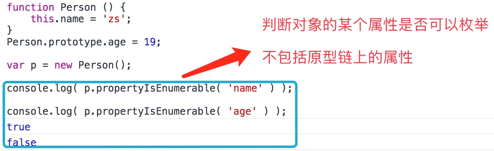

- `o1.isPrototypeOf(o2)`:判断对象o1是否是对象o2的原型对象

		function Person () {
	    	this.name = 'zs';
		}
		Person.prototype.age = 19;
		
		var p = new Person();
		
		console.log(Person.prototype.isPrototypeOf(p));

### 包装对象

- 三种基本包装类型: `Number` `String` `Boolean`

- 包装类型出现的目的:在开发中常常会使用基本数据类型, 但是基本数据类型没有方法, 因此 js 引擎会在需要的时候**自动**的将基本类型转换成对象类型.

- **实现原理**: 基本类型调用方法时,解释器首先将基本类型转换成对应的对象类型, 然后调用方法. 
	方法执行结束后, 这个对象就被立刻回收
	
- 在 apply 和 call 调用的时候, 也会有转换发生. 上下文调用的第一个参数必须是对象. 如果传递的是数字就会自动转换成对应的包装类型

### getter和setter读写器

> getter和setter读写器本质是一种**语法糖**: 为了方便开发而给出的语法结构

	// 基本语法 使用get 和 set 关键字
	var o = (function () {
		var num = 123;
		return {
				
			// get 名字 () { 逻辑体 }
			get num () {
				return num;
			}

			// set 名字 ( v ) { 逻辑体 }
			set num ( v ) {
				num = v;
			}
		};
	})();

- 闭包原始结构

		var o = (function () {
			var num = 123;
			return {
				get_num: function () {
					return num;
				},
				set_num: function ( v ) {
					num = v;
				}
			};
		})();
	
		// 获得数据
		o.get_num();			
	
		// 设置
		o.set_num( 456 );

- 使用读写器改写

		var o = (function () {
			var num = 13;
			return {					
				get num () {
					console.log( '执行 getter 读写器了' );
					return num;
				},
	
				set num ( v ) {
					console.log( '执行 setter 读写器了' );
					if ( v < 0 || v > 150 ) {
						console.log( '赋值超出范围, 不成功 ' );
						return;
					}	
					num = v;
				}
			};
		})();

		// 获取数据
		console.log( o.num );
	
		// 设置数据
		o.num = 33;
	
		console.log( o.num );

### ES5数组方法

- `forEach`:遍历数组
	- 语法:`数组.forEach(fn)`

			var arr = [{name:'zs'},{name:'ls'},{name:'ww'}];
			
			arr.forEach(function(v,i){
				console.log('值' + v.name + ',索引' + i);
			});

- `map`:映射(利用数组通过函数中的算法生成一个数组)
	- 语法:`数组.map(fn)`,返回一个数组,数组中的每一个元素就是map函数中fn的返回值

			var arr = [1,2,3,4];
			
			var newArr = arr.map(function(v,i){
				return v * v;
			});
			
			console.log(newArr);

- `filter`:过滤筛选
	- 语法:`数组.filter(fn)`,返回一个数组,筛选出满足条件的数据(满足条件返回true,不满足返回false)

			// 筛选出奇数
			var arr = [ 1, 2, 3, 4, 5, 6 ];
			var a = arr.filter( function ( v ) { 
				return v % 2 === 1;
			});
			console.log(a);
			
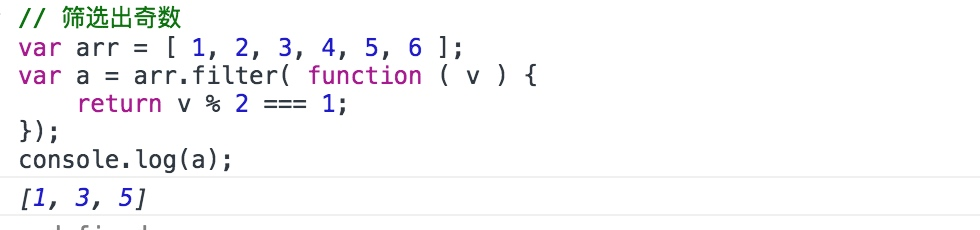

- `some`:判断数组中至少有一个数据符合要求,返回true,否则返回false
	- 语法:`数组.some(fn)`
		
			var arr = [ '123', {}, function () {}, '123' ];
			// 判断数组中至少有一个数字 则返回true
			var isTrue = arr.some( function ( v ) { 
				return typeof v === 'number';
			} );
			
			console.log(isTrue);
			

- `every`:必须满足所有元素都符合要求才会返回 true
	- 语法:`数组.every(fn)`
	
			var arr = [ 1, 2, 3, 4, 5, '6' ];
			var isTrue = arr.every( function ( v ) { 
				// 如果都是数字则返回true
				return typeof v === 'number';
			} );
			
			console.log(isTrue);

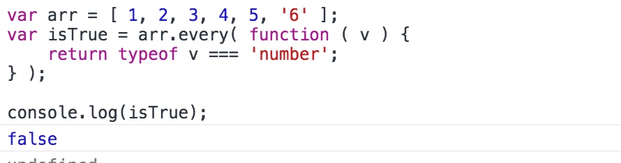

- `indexOf`:从数组中查找某个数据的索引(从左向右查找)
	- 语法:`数组.indexOf(元素,从哪个位置开始查找)`

			var arr = [ 1, 2, 3, 4, 5 ];
			// 不传第二个参数,默认是0
			var res = arr.indexOf( 4 );
			console.log( res );
		
			var arr = [ 1, 2, 3, 4, 5, 4, 5, 6 ];
			// 从索引4开始查找元素4
			var res = arr.indexOf( 4, 4 );
			console.log( res );

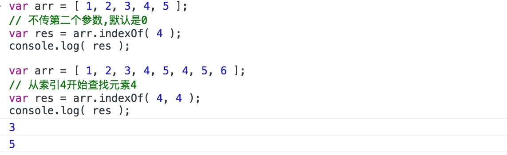

- `lastIndexOf`:从数组中查找某个数据的索引(从右向左查找)
	- 语法:`数组.lastIndexOf(元素,从哪个位置开始查找)`

			var arr = [ 1, 2, 3, 4, 5 ];
			// 不传第二个参数,默认是0
			var res = arr.lastIndexOf( 4 );
			console.log( res );
		
			var arr = [ 1, 2, 3, 4, 5, 4, 5, 6 ];
			// 从索引4开始查找元素4
			var res = arr.lastIndexOf( 4, 4 );
			console.log( res );

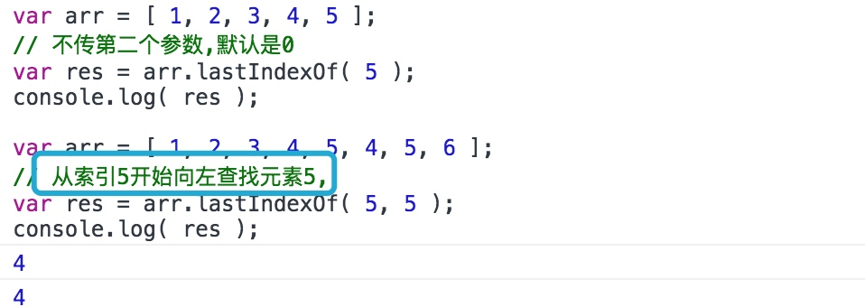

# 正则表达式

## 什么是正则表达式?

> 正则表达式就是一个*用于查找的*含有**匹配字符串**或**匹配元字符**的字符串

## 正则表达式对象

> js正则表达式对象就是由正则表达式创建的对象，该对象可以进行匹配，提取和替换。

### 创建正则表达式对象

#### 构造函数

	var regex = new RegExp(正则表达式字符串);
	
	eg:
	var regex = new RegExp("abc");//匹配包含abc的字符串
		
#### 正则字面量

	var regex = /正则表达式/;
	
	eg:
	var rehex = /abc/; // 注意双斜线中的字符串不需要再用引号	

### 正则表达式对象的基本使用

- 判断字符串‘abcdefghigkhshssgehshsgdjagsjsgahajdkadna’中是否包含某个特定的字符串

- 使用正则方式

		// 匹配是否含有字符串js
		var str = 'abcdefghigkhshssgehshsgdjagsjsgahajdkadna'; 
		// 1.创建正则对象
		// var r1 = new RegExp('js'); // 构造函数形式
		var r2 = /js/; // 字面量形式
		
		// 2.开始检查匹配
		var res = r2.test(str);
		console.log(res);
		
		// 如果包含则返回true 不包含返回false

## 元字符

### 基本元字符

- `.`:表示任意一个非换行的字符

		foo. 可以匹配到以foo开头的任意字符串
	
- `()`:表示分组和提高优先级
- `[]`:表示一个字符
	- 用法:[abc] 表示出现在[]中的任意一个字符 匹配a,或b,或c
	- 可以认为是`.`的带限制升级版
		
			[abc] 可以匹配到字符a或字符b或字符c
			
- `|`:或的意思
	- 用法:正则表达式1|正则表达式2
	- 可以认为是`[]`匹配多个字符串的扩展版

			abc|123 可以匹配到字符串abc或123

- `\`转义字符

		 表示 .: \.
		 表示 [] : \[\]
		 表示 (): \(\)
		 表示 \ : \\

### 限定元字符

- `*`: 紧跟前面的一个字符或一组字符出现0次到多次

		- 匹配一个字符正则:123*  前面一个字符3在后面出现的次数
		
		12       0次
		123   	1次
		1233  	2次
		12333 	3次
		
		- 匹配一组字符正则:1(23)*  前面一组字符23在后面出现的次数
		1   		0次
		123      	1次
		12323		2次

- `+`: 紧跟在前面的字符出现一次到多次,`+`号前面的这个也匹配

		正则123+
		123		1次
		1233	2次
		
- `？`: 紧跟在前面的字符出现0次或1次

		q:在一段字符串中检查是否含有http协议字符串或https协议字符串
		a1: http://.+|https://.+   使用|匹配两者
		a2: https?://.+  s出现0次或1次正好是http或https
		
- `{数字}`: 紧跟在前面的字符出现指定的次数

		正则a{3} 只能匹配到字符串中有aaa的
		
		aabbcc 		匹配不到
		aaa    		能匹配到
		aaaaaa 		不能匹配
		

- `{数字,}`: 紧跟在前面的字符至少出现指定的次数

		正则a{3,} 可以匹配到字符串中至少出现了3个aaa的
		
		aaa 		能匹配到
		aaaaaa		能匹配到

- `{数字,数字}`: 紧跟在前面的字符出现的次数范围

		正则a{1,3} 可以匹配到出现一次a 2次a 3次a的字符串
		
		abc			能匹配到
		aabc		能匹配到
		aaabc		能匹配到

### 首尾元字符

- `^`: 表示必须以指定的字符开始

		正则^a  匹配以a开头的字符串
		
		abc 		能匹配到
		cba		不能匹配
		
- `$`: 表示必须以指定的字符结尾

		正则a$  匹配以a结尾的字符
		
		abc		不能匹配
		cba		能匹配到

- 案例`^a+$`: 匹配全是a的字符串

		var reg = /^a+$/;
		
		console.log(reg.test('a')); // true
		console.log(reg.test('abc')); // false
		console.log(reg.test('aaaaaa')); // true
		console.log(reg.test('baaa')); // false
		

### 简写元字符

- `\s`: 空白字符(包括空格 tab 回车换行等)
- `\S`: 非空白字符

		[\s\S]表示任意字符
	
- `\w`: 表示字符,包含字母、数字、下划线
- `\W`: 非字符

- `\d`: 数字
- `\D`: 非数字
		
### 否定元字符(负向类)

> 不出现某个需要匹配的字符,使用`[^字符]`

	[^abc] 不是a不是b也不是c的字符
	也就是只要不是abc三个字符中任意一个都可以匹配到
		
## 正则案例
	
### 匹配身份证	

	身份证是 18 位数字
	省 市 区 出生年月 随机编码X
	1) 首先是要做匹配, 就一定要使用 ^ $
	2) 是 18 位数字( 0, 1, 2, 3, 4, 5, 6, 7, 8, 9 ). 可以使用 [0123456789]
		还可以使用 0|1|2|3|4|5|6|7|8|9
	3) 要求是 18 位. 限定 18 位, 即 {18}
	
	组合: ^[0123456789]{18}$

	如果最后一位是x
	前面 17 位数字: ^[0123456789]{17}$
	
	组合: ^[0123456789]{17}[0123456789x]$

### 匹配邮箱

	名字 @ 主机名

	1) 是要验证邮箱, 那么就需要使用 ^ $
	2) 名字:
		数字与字母
		[0123456789]
		[abcdefghi...]
		[ABCDEFG...]

		[] 里面的字符如果是编码序号连续的可以使用连字符连接
		数字: [0-9]  
			  [9-0] 错误的, 编码逆序
		字母: [a-z]
			  [A-Z]
		整合: [0-9a-zA-Z]

		名字的变式方法: [0-9a-zA-Z]+
	3) 主机名
		主机名也是一串字符串或数字
		但是它多了一个 .com .cn
	
	3.1) 只有名字	 [0-9a-zA-Z]+

	3.2) 只含有一个 .什么
		开始 \.
		中间 [0-9a-zA-Z]+
		只含有一个名字: \.[0-9a-zA-Z]+

	3.3) 含有多个名字
		.com.con.cc.c1.c2.c3
		即 .什么 出现一次到多次

		(\.[0-9a-zA-Z]+)+

	最后主机名可以写成
		[0-9a-zA-Z]+(\.[0-9a-zA-Z]+)+

	最后整合一下
	^[0-9a-zA-Z]+@[0-9a-zA-Z]+(\.[0-9a-zA-Z]+)+$

### 匹配数字
#### 任意整数

	1) 由于是匹配, 包含 ^ $
	2) 首先第一个字符不允许是 0, 所以第一个可以写成 [1-9]
	3) 后面的数字就是 [0-9]
	4) 要求后面的数字出现 0 次到多次, 以匹配任意的 非 0 数字: [1-9][0-9]*
	5) 由于还需要考虑 0, 因此写成 [1-9][0-9]*|0
	6) 考虑 | 优先级最低: ^([1-9][0-9]*|0)$

	^(-?[1-9][0-9]*|0)$

#### 任意范围的整数

	如果要匹配指定范围的数字, 那么需要将字符串结构进行分类
	1) 0 要匹配的, 所以在正则表达式中有 0 这一项
	2) 任意的 2 位数, 即 [1-9][0-9]
	3) 任意的 1 位数, 即 [0-9], 可以将 第 1) 结论合并
	4) 考虑 3 位数的时候, 只允许出现 1xx 的任意数, 而 2xx 的有限制
		因此在分组, 考虑 1xx 的任意数, 可以写成: 1[0-9][0-9]
	5) 考虑 2xx 的数字, 在 200 到 250 之间允许任意取. 所以
		写成: 2[0-4][0-9]
	6) 考虑 250 到 255, 写成 25[0-5]
	
	^([0-9]|[1-9][0-9]|1[0-9][0-9]|2[0-4][0-9]|25[0-5])$
	
#### 任意小数

	要求, 小数不允许以 0 结尾
	3.1415
	[0-9]*[1-9]

	^((-?[1-9][0-9]*|0)(\.[0-9]*[1-9])?)$

	(aaa)?	这个内容出现或不出现
	(aaa|)	也是表达aaa可出现可不出现
	^((-?[1-9][0-9]*|0)(\.[0-9]*[1-9]|))$

## 提取(exec)

### exec基本使用

- 作用:将匹配到的内容提取出来
- 语法:`正则对象.exec('字符串')` 返回一个装提取到的内容对象的数组

		eg: 从‘abc123ddds567sss789lkj’中提取数字
		
		var str = ‘abc123ddds567sss789lkj’;
		var regexp = /\d+/;
		var result = regexp.exec(str); 
		
		/*只能提取到一个*/
		
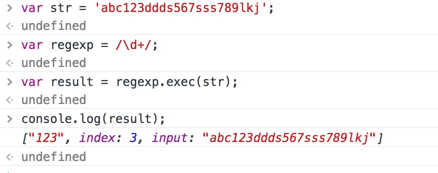

### 循环提取

- 循环提取:将所有符合要求的匹配内容提取出来
- 使用:

		1.需要开启正则的全局模式
		var r = new RegExp('正则','g');
		var r = /正则/g;
		
		2.循环调用exec 直到返回null
		
- 案例:

		eg: 从‘abc123ddds567sss789lkj’中提取数字

		var str = ‘abc123ddds567sss789lkj’;
		// 1.全局模式
		var regexp = /\d+/g;
		
		// 2.循环匹配
		var result;
		while(result = regexp.exec(str)){
			console.log(result);
		}
		
		/*每次匹配到的都是一个数组,数组中的第0项是匹配内容的对象*/

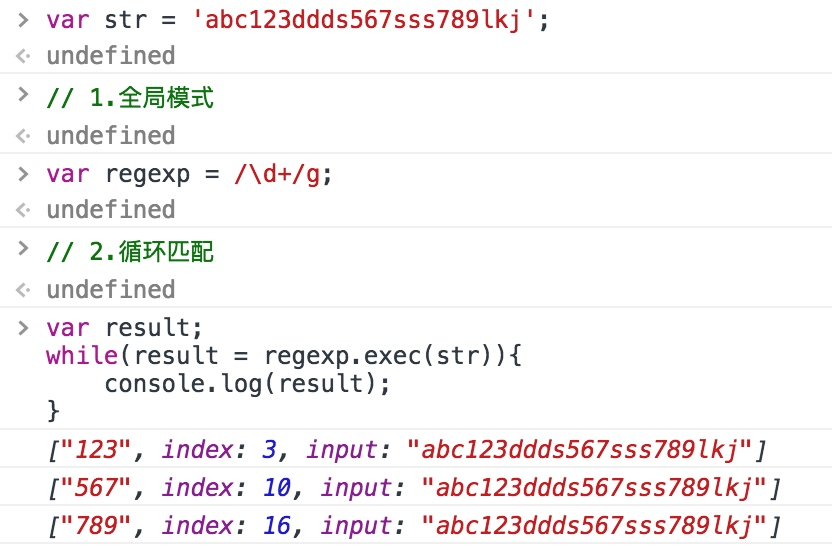

### 分组提取

> 将匹配到的结果进行解析,在正则中使用括号()进行分组,那么得到的结果将会是一个数组,数组的长度是正则中左括号出现的次数+1,第0项数据是整个正则的匹配结果,后续项分别是每一对括号匹配到的数据,其中从左向右出现的左括号分别被编号1,2,3...

	// 提取出这个字符串中的邮箱 以及每一个邮箱的用户名和主机地址
	var str = '我有一个邮箱, 是 abc@itcast.cn, 还有 abc@126.com, 和 1234567@qq.com'
	var r = /([a-zA-Z\d]+)@([a-zA-Z\d]+(\.[a-zA-Z\d]+)+)/g;
	var res = r.exec( str );
	console.log(res);

	/*单个提取*/

	// 提取邮箱出这个字符串中的邮箱 以及每一个邮箱的用户名和主机地址
	var str = '我有一个邮箱, 是 abc@itcast.cn, 还有 abc@126.com, 和 1234567@qq.com'
	var r = /([a-zA-Z\d]+)@([a-zA-Z\d]+(\.[a-zA-Z\d]+)+)/g;
	var res;
	while (res = r.exec(str)){
		console.log( '邮箱是: ' + res[ 0 ] + 
					 ', 用户名: ' + res[ 1 ] + 
					 ', 主机名: ' + res[ 2 ] );
	}

	/*提取出这个字符串中所有的邮箱*/

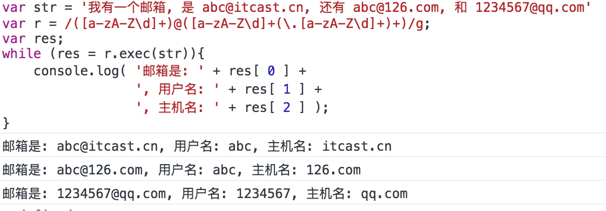

## 匹配但不捕获元字符

> 在组中添加`?:`后,依旧会去匹配这个组,但是不会出现在结果中

	// 提取出这个字符串中的邮箱 以及每一个邮箱的用户名和主机地址
	var str = '我有一个邮箱, 是 abc@itcast.cn, 还有 abc@126.com, 和 1234567@qq.com'
	var r = /([a-zA-Z\d]+)@([a-zA-Z\d]+(\.[a-zA-Z\d]+)+)/g;
	var res = r.exec( str );
	console.log(res);
	
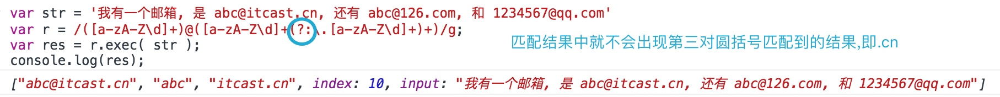

## 反向引用

> 在正则表达式中使用组匹配到某一个数据,可以在该正则表达式中使用‘\数字’的方式引用该组,数字代表被引用组的编号

	// 提取str中的html标签
	var str = '123
456
7890<i></i>abc';
	// \1表示引用前面的组(\w+)
	var r = /<(\w+)>.*<\/\1>/g;
	// 循环提取
	var res;
	while ( res = r.exec(str) ) {
		console.log( res[ 0 ] );
	}

## 贪婪模式

	凡是在正则表达式中, 涉及到次数限定的, 一般默认都是尽可能的多匹配.

	取消贪婪模式. 在次数限定符后面加上 ?

	注意: 贪婪模式性能会略高于非贪婪模式, 所以开发的时候. 一般不考虑贪婪的问题
		只有代码匹配结果出现问题了, 一般一次多匹配了, 才会取消贪婪

	- 多个贪婪在一起的时候的强度:第一个最强 后面强度一样
	
	/(\d+)(\d+)(\d+)/.exec('1234567');
	
	'12345','6','7'

	- 取消贪婪模式

	/(\d+?)(\d+)(\d+)/.exec('1234567');
	
	'1','23456','7'

